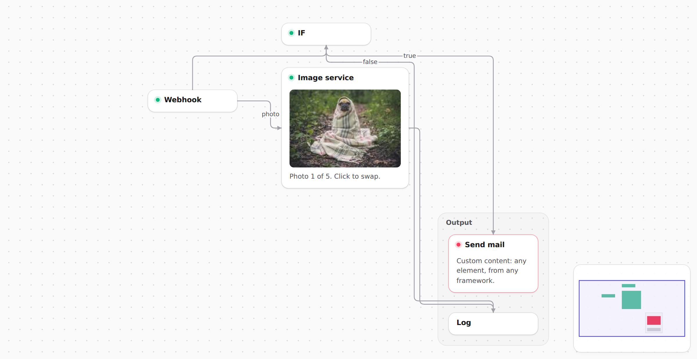
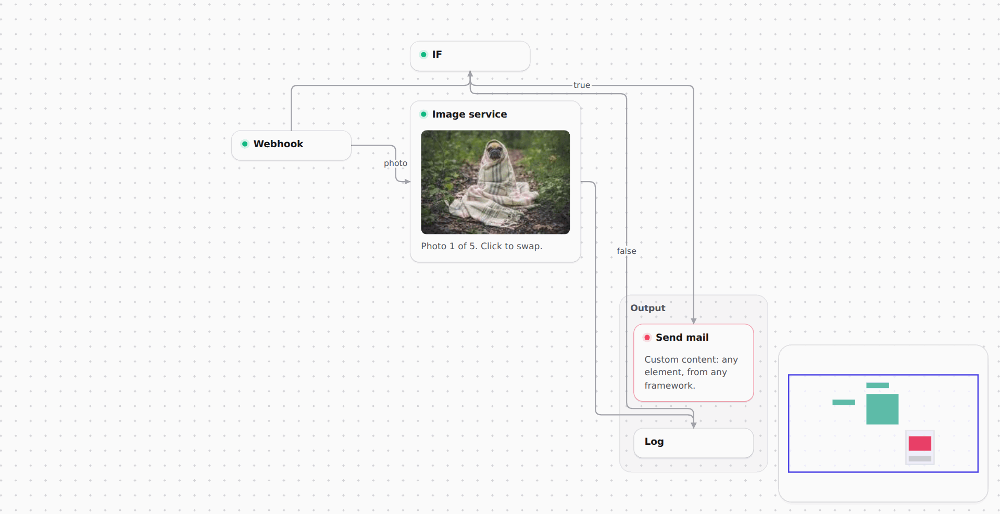
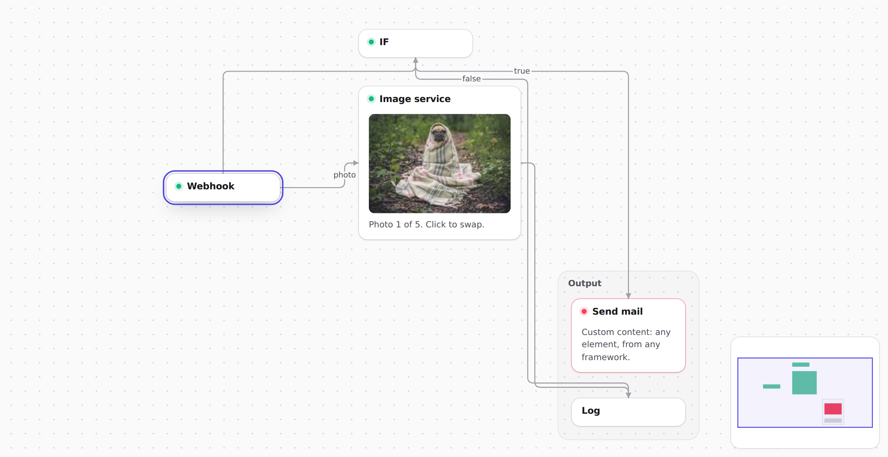
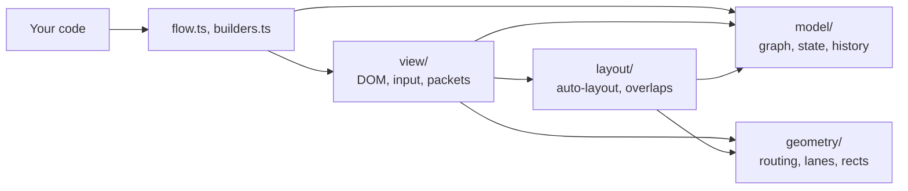

# betternodes

[](LICENSE)


A small, framework-agnostic node graph viewer and editor. Define nodes and wires in code, show
them read-only, or let users edit them drawio-style. Every user edit comes out as JSON.

<picture>
  <source media="(prefers-color-scheme: dark)" srcset="docs/screenshots/overview-dark.png">
  
</picture>

```ts
const f = flow(document.getElementById('graph')!)
f.node('hook').title('Webhook')
f.node('mail').title('Send mail')
f.connect('hook', 'mail', { label: 'new order' })
```

## Contents

- [Features](#features)
- [Installation](#installation)
- [Quick start](#quick-start)
- [Guide](#guide): modes, anchors, wires, layout, groups, state, packets, custom content, frameworks
- [API reference](#api-reference)
- [Editor controls](#editor-controls)
- [Persistence](#persistence)
- [Theming](#theming)
- [Performance](#performance)
- [Browser support](#browser-support)
- [Architecture](#architecture)
- [Development](#development)
- [Contributing](#contributing)
- [License](#license)

## Features

- **Zero runtime dependencies**, about 16.9 kB min+gzip plus 2.4 kB of CSS.
- **Plain DOM and SVG**: works with React, Vue, Svelte or no framework. Node content is any element.
- **View and edit modes**: drag wires between connection points, move and delete nodes, undo and redo.
- **Right-angled wires** that route around nodes, share corridors in lanes and carry notes.
- **Auto-layout** in columns, and nodes that never stay on top of each other.
- **Groups, a minimap, and light and dark themes** built from CSS variables.
- **Animated packets** drawn with WebGL, smooth with thousands at once.
- **JSON state and diffs** for every user edit.
- **Fast with 1000+ nodes**: one batch of DOM writes per frame, drags touch only nearby wires.
- **Typed API**: wire ends and event listeners are checked at compile time.

## Installation

Not on npm yet. Install from GitHub:

```sh
npm install --allow-git=root github:virtualtear/betternodes#v0.1.0
```

npm 12 and later need `--allow-git=root`, or `allow-git=root` in your `.npmrc`. npm builds
`dist/` on install, which needs Node.js 20.19+ or 22.12+; a warning that `prepare` was blocked by
`allowScripts` is harmless. Put another tag or a commit after `#`, or leave it off for `main`.

## Quick start

```ts
import { flow } from 'betternodes'
import 'betternodes/style.css'

const f = flow(document.getElementById('graph')!) // the element needs a size, e.g. height: 600px

f.node('hook').title('Webhook')
f.node('if').title('IF')
f.node('mail').title('Send mail')
f.connect('hook', 'if').connect('if', 'mail')     // auto-laid out and fitted into view

f.mode('edit')                                      // default is 'view'
f.on('change', state => localStorage.setItem('graph', JSON.stringify(state)))
```

## Guide

### Modes

View mode is read-only: dragging pans, the wheel zooms, a click selects a node. Edit mode adds
creating, moving and deleting wires and nodes. Switch with `f.mode('view' | 'edit')`;
[options](#options) turn single parts off.

### Anchors

Every node has eight connection points: `nw n ne e se s sw w`. A wire end is either fixed,
`'nodeId.anchor'` (e.g. `'a.e'`), or floating, a bare `'nodeId'` that attaches to the side facing
the other end. In the editor, dropping a wire on a connection point makes a fixed end, dropping it
on the node body a floating one.

### Wires

Wires run at right angles, go around nodes and spread side by side where they share a corridor.
Moving a node re-routes only the wires it affects. In very crowded graphs a wire may fall back to a
simple shape that passes behind a node.

```ts
f.connect('if', 'mail', { label: 'true', class: 'error' })
f.label('if', 'mail', 'yes')               // change the note; no text removes it
f.wireClass('if', 'mail', 'bn-two-way')    // replace the classes; no names clear them
```

Notes and classes belong to your code, not to `state()`. They survive deleting the wire, so undo
brings them back, and move with a wire end the user reconnects. Built-in classes: `bn-two-way`
adds an arrowhead at the start, `bn-no-arrow` removes both. On the root element they apply to
every wire.

### Layout and fit

Nodes without a position are laid out once, in columns that follow the wires; nodes added later go
to the right. Positions from `at()`, `load()` or dragging always win. `f.layout()` re-arranges
everything.

The first render fits the graph into view, never zooming past 100%. `f.fit()` fits again,
`f.fit('a', 'b')` shows just those nodes. To restore a saved viewport, pass it right after mounting:

```ts
f.viewport(JSON.parse(localStorage.getItem('view') ?? '{}'))
f.on('viewport', v => localStorage.setItem('view', JSON.stringify(v)))
```

### No overlapping nodes

When code, a saved state or growing content puts nodes on top of each other, the one defined later
moves to the nearest free spot. This shows in `state()` but fires no `change`. Dragged nodes may
pass over others; on drop they settle at least 10px from their neighbours.

### Groups

```ts
f.group('intake').title('Intake').nodes('hook', 'if')
f.group('intake').class('running')   // CSS classes on the frame
f.ungroup('intake')                  // removes the frame, keeps the nodes
```

A group draws a titled frame around its members. Pressing the title selects them, dragging it moves
them as one edit. Groups belong to your code, not to `state()`. A node is in one group at most, and
members that don't exist yet are fine. Auto-layout and drops keep nodes out of other groups'
frames. Groups don't nest or collapse, and wires route through them.

### State

Node definitions live in your code. Everything the editor changes is a small JSON object:

```ts
type State = {
  positions: Record<string, [x: number, y: number]>
  edges: [from: string, to: string][]
  removed?: string[] // nodes the user deleted; only present when there are any
}
```

Save it on `change` and restore it with `load()`, see [Persistence](#persistence).

### Packets

`f.send()` animates dots along the wires, in both modes:

```ts
await f.send('hook', 'mail')                         // ['mail'], or [] if it could not get there
await f.send('hook')                                 // flow: end nodes reached, e.g. ['mail', 'log']
f.send('if', 'log', { class: 'error', speed: 400 })  // CSS class on the dot, speed in px per second
```

Packets follow wires that re-route, and re-plan when their wire or node goes away; with no route
left they fade out. They are drawn with WebGL2, or as SVG circles without it, and styled with CSS
(see [Theming](#theming)).

<picture>
  <source media="(prefers-color-scheme: dark)" srcset="docs/screenshots/burst-dark.gif">
  
</picture>

### Custom content

`.content(el)` mounts any element below the node's title. The node resizes with it, and its wires
and neighbours adjust. A node that swaps its photo on click:

```ts
const img = document.createElement('img')
img.src = photos[0]
img.width = 200
img.height = 140       // final size up front, so layout and fit don't jump when the image loads
img.draggable = false  // a native image drag would cancel the pan or node drag
img.onload = () => f.node('image').class('ok')
img.onerror = () => f.node('image').class('error')
f.node('image').title('Image service').content(img)

f.on('click', ({ node }) => {
  if (node !== 'image') return
  f.node('image').class('busy')
  img.src = photos[Math.floor(Math.random() * photos.length)]
})
```

- Pressing inside content still pans or drags the node. Stop `pointerdown` on controls that need
  the pointer: `button.addEventListener('pointerdown', e => e.stopPropagation())`.
- Editor keys never act while focus is inside your content.
- Titles are plain text. Content is your own element, so escaping inside it is up to you.

### Using a framework

Mount the graph once into a sized element and destroy it on unmount. Render node content into a
plain element and pass that to `.content()`.

```tsx
import { useEffect, useRef } from 'react'
import { createRoot } from 'react-dom/client'
import { flow } from 'betternodes'
import 'betternodes/style.css'

export function Graph() {
  const ref = useRef<HTMLDivElement>(null)
  useEffect(() => {
    const f = flow(ref.current!)
    const preview = document.createElement('div')
    const root = createRoot(preview)
    root.render(<Preview />)
    f.node('a').title('Source').content(preview)
    f.node('b').title('Target')
    f.connect('a', 'b')
    const ac = new AbortController()
    f.on('change', save, { signal: ac.signal })
    return () => {
      ac.abort()
      f.destroy()
      root.unmount()
    }
  }, [])
  return <div ref={ref} style={{ height: 600 }} />
}
```

Vue: `createApp(Preview).mount(el)`. Svelte 5: `mount(Preview, { target: el })`. Then
`f.node(id).content(el)`.

## API reference

### `flow(root: HTMLElement, options?: FlowOptions): Flow`

Mounts a graph inside `root`, which must have a size.

### Options

Pass options when mounting, or change them later with `f.set()`; left-out fields keep their value.

```ts
const f = flow(el, { zoom: false, pan: false })        // embedded diagram: the page keeps scrolling
f.set({ mode: 'edit', connect: false, remove: false })  // users may arrange, not rewire or delete
```

| Option | Default | What it controls |
| --- | --- | --- |
| `mode` | `'view'` | Mode to start in; in `set()` it switches modes. |
| `zoom` | `true` | Wheel and pinch zoom. When off, the page scrolls instead. |
| `minZoom` | `0.1` | Smallest zoom for the wheel and for fitting. |
| `maxZoom` | `4` | Largest zoom for the wheel. Fitting never zooms past 100%. |
| `pan` | `true` | Panning by dragging, and scrolling at the edge while dragging. |
| `fit` | `true` | Fitting the graph into view on the first render. |
| `select` | `true` | Selecting by click, Shift+click, selection box and Esc. |
| `keys` | `true` | Editor keys: Delete, Backspace, Ctrl+Z, Ctrl+Y and Esc. |
| `history` | `100` | How many edits undo can revert; `0` turns undo off. |
| `connect` | `true` | Edit mode: drawing and reconnecting wires. |
| `move` | `true` | Edit mode: dragging nodes. When off, dragging pans. |
| `remove` | `true` | Edit mode: deleting nodes and wires. |
| `snap` | `true` | Snapping dropped nodes to the 20px grid. |
| `minimap` | `false` | An overview in the bottom-right corner; click or drag in it to pan. |
| `canConnect` | allows all | `(from, to) => boolean`, asked before a wire the user draws or reconnects is made. |

Options only limit users; calls from your code always work. Mounting or `set()` throws if `minZoom`
ends up above `maxZoom`, a zoom is not a finite number above 0, or `history` is not a whole number
of 0 or more. Edit rights that are off show in a `data-lock` attribute on the root, e.g.
`data-lock="connect remove"`.

### Nodes: `f.node(id)`

Returns a chainable builder for a new or existing node. Ids must not contain `.` or `>`.

| Method | Description |
| --- | --- |
| `.title(text)` | Title text; defaults to the id. |
| `.at(x, y)` | Top-left corner in world px, within ±10,000,000. Without it, auto-layout places the node. |
| `.content(el)` | Custom element below the title. |
| `.class(...names)` | Extra CSS classes, replacing earlier ones, e.g. `'error'`. |

`f.remove(id)` deletes a node and its wires. Deleted nodes are listed in `state().removed`, so they
stay deleted after a reload; only undo or `load()` bring them back.

### Groups: `f.group(id)`

| Method | Description |
| --- | --- |
| `.title(text)` | Frame title; defaults to the id. |
| `.nodes(...ids)` | The members, replacing earlier ones. |
| `.class(...names)` | Extra CSS classes on the frame. |

`f.ungroup(id)` removes the frame and keeps the nodes.

### Wires

| Method | Description |
| --- | --- |
| `f.connect(from, to, { label, class })` | Adds a wire, optionally with a note and a CSS class. |
| `f.disconnect(from, to)` | Removes a wire. |
| `f.label(from, to, text?)` | Sets or removes the note on a wire. |
| `f.wireClass(from, to, ...names)` | Sets the wire's CSS classes; each name must be one class (not empty, no spaces). |

Ends are `'nodeId.anchor'` or `'nodeId'`. String literals are checked at compile time, other strings
at runtime.

### Packets

| Call | What travels |
| --- | --- |
| `f.send(from, to, opts?)` | One packet to `to` over the fewest hops, picking each next wire as it goes. |
| `f.send(from, undefined, opts?)` | A flow that splits along every outgoing wire, each wire once per send. |

`opts` is `{ class?, speed? }`: one CSS class, and a speed in world px per second above 0 (default
240). The promise resolves
with the nodes reached: `[to]` or `[]` for one packet, the end nodes for a flow.

### Selection

```ts
f.on('select', ({ nodes, wire }) => {
  if (nodes.length === 1) inspector.show(nodes[0])
  else inspector.hide()
})
```

| Method | Description |
| --- | --- |
| `f.on('select', selection => {})` | Selection changed, by the user or code. `selection` is `{ nodes, wire? }`. |
| `f.select(...ids)` | Selects these nodes; no ids clear the selection. |
| `f.selection()` | The current selection. |

`select` never fires when the selection stayed the same, so calling `f.select()` from a listener is
safe.

### Events

```ts
f.on('contextmenu', (hit, event) => {
  event.preventDefault()   // no browser menu
  menu.open(hit, event.clientX, event.clientY)
})
```

| Event | Listener gets | Fires when |
| --- | --- | --- |
| `change` | `(state, diff)` | After every user edit, including undo and redo; never for code. |
| `click` | `(hit, event)` | A press that moved less than 4px. |
| `dblclick`, `contextmenu` | `(hit, event)` | The browser events of the same name. |
| `hover` | `(hit)` | The pointer moves onto another node or wire, or off them. |
| `viewport` | `({ x, y, zoom })` | Pan or zoom changed; at most once per frame. |

`hit` is `{ node }`, `{ wire: [from, to] }`, `{ group }` or `{}` for the background. Pointer events
fire in both modes whatever the options say. Pass `{ signal }` as the third argument to unsubscribe.

### Everything else

| Method | Description |
| --- | --- |
| `f.mode('view' \| 'edit')` | Switches modes. |
| `f.set(options)` | Changes [options](#options). |
| `f.state()` / `f.load(state)` | Saves or restores positions and wires. Invalid saved wires, malformed entries and coordinates beyond ±10,000,000 are dropped with a warning; a state of the wrong shape changes nothing. |
| `f.undo()` / `f.redo()` | Reverts or re-applies a user edit and emits `change`. |
| `f.layout()` | Re-arranges every node now; emits no `change`. |
| `f.fit(...ids)` | Fits these nodes, or all, into view. |
| `f.viewport()` | The current `{ x, y, zoom }`. |
| `f.viewport({ x?, y?, zoom? })` | Pans and zooms. |
| `f.zoomBy(factor)` | Zooms around the middle of the view. |
| `f.destroy()` | Removes everything betternodes added to `root`. |

Undo restores the state from just before an edit, so later changes from your code are reverted too.

### Exported types

`Flow`, `NodeBuilder`, `GroupBuilder`, `FlowOptions`, `FlowEvents`, `State`, `Diff`, `Edge`,
`Anchor`, `End`, `Selection`, `Hit`, `Viewport` and `SendOptions`.

## Editor controls

<picture>
  <source media="(prefers-color-scheme: dark)" srcset="docs/screenshots/editing-dark.png">
  
</picture>

| Action | How |
| --- | --- |
| Pan | Drag the background; in view mode, drag anywhere. |
| Zoom | Wheel or pinch. |
| Select | Click a node or wire. Esc or a click on empty space deselects. |
| Select several | Shift+click nodes, or Shift+drag a box on the background. |
| Move nodes | Drag a node; selected nodes move together and snap to the grid on drop. |
| Move a group | Drag its frame's title. |
| Scroll while dragging | Move the pointer near the edge of the graph. |
| New wire | Drag from a node's connection point to another node. |
| Move a wire end | Drag a wire near the end you want to move. |
| Select all | Ctrl+A (Cmd+A on macOS). |
| Nudge | Arrow keys move the selected nodes one grid step. |
| Delete | Delete or Backspace. |
| Undo / redo | Ctrl+Z / Ctrl+Shift+Z or Ctrl+Y (Cmd on macOS). |

Keys act while the graph has focus, never while typing in your node content.

## Persistence

```ts
f.load(JSON.parse(localStorage.getItem('graph') ?? 'null'))
f.on('change', state => localStorage.setItem('graph', JSON.stringify(state)))
```

Or send only what changed:

```ts
f.on('change', (_, diff) => api.patch('/graph', diff))
// diff = { added: [['a.e', 'b']], removed: [], moved: { a: [120, 60] }, nodesRemoved: [], nodesRestored: [] }
```

`f.layout()` emits no `change`, so save `f.state()` yourself after it.

## Theming

Light by default. For dark, add a class to the root element:

```ts
el.classList.add('bn-dark')   // always dark
el.classList.add('bn-auto')   // follows the system
```

Every colour variable is a `light-dark()` pair; override it on `.bn` or your root element.

| Variable | Default (light / dark) | Used for |
| --- | --- | --- |
| `--bn-bg` | `#fafafa` / `#09090b` | Background, and the halo behind wire notes |
| `--bn-grid` | `#d4d4d8` / `#27272a` | Grid dots |
| `--bn-node-bg` | `#fff` / `#18181b` | Node background |
| `--bn-node-border` | zinc 10% / white 10% | Node outline |
| `--bn-node-hover` | zinc 20% / white 20% | Node outline on hover and drag |
| `--bn-shadow` | zinc 6% / black 50% | Node and minimap shadows |
| `--bn-text` | `#18181b` / `#fafafa` | Text |
| `--bn-text-muted` | `#52525b` / `#a1a1aa` | Wire notes, group titles |
| `--bn-accent` | `#4f46e5` / `#818cf8` | Selection, hovered connection points, wire being dragged |
| `--bn-wire` | `#a1a1aa` / `#52525b` | Wires |
| `--bn-wire-hover` | `#71717a` / `#a1a1aa` | Hovered wires, connection point rings |
| `--bn-packet` | `--bn-accent` | Packets |
| `--bn-radius` | `12px` | Node corner radius |
| `--bn-anchor` | `9px` | Connection point size |
| `--bn-group-bg` | zinc 2.5% / white 3% | Group frame background |
| `--bn-group-border` | zinc 8% / white 8% | Group frame outline |
| `--bn-minimap-bg` | white 90% / zinc 90% | Minimap background |
| `--bn-minimap-node` | `#d4d4d8` / `#3f3f46` | Nodes in the minimap |
| `--bn-minimap-view` | `--bn-accent` | Visible area in the minimap |

| Element | Selector |
| --- | --- |
| Node, title | `.bn-node`, `.bn-title` |
| Selected, dragged | `.bn-selected`, `.bn-dragging` |
| Wire, its path, its note | `<g data-wire>`, `.bn-wire`, `.bn-label` |
| Group frame, title | `.bn-group`, `.bn-group-title` |
| Minimap, its nodes | `.bn-minimap`, `.bn-mini-node` |
| Selection box | `.bn-band` |
| Packet | `.bn-packet` |

Classes from `.class()`, `wireClass()` and `send({ class })` land on these elements, and minimap
nodes copy their node's classes. Packets read only `fill`, `stroke`, `stroke-width` and `r`, or all of CSS without WebGL2. For a
node status, set the outline variables rather than `box-shadow`, so hover and drag shadows keep
working:

```css
.bn-node.error { --bn-node-border: #f43f5e80; --bn-node-hover: #f43f5e; }
.error .bn-wire { stroke: #f43f5e; }
.bn-packet.error { fill: #f43f5e; }
```

## Performance

Medians from `npm run bench` in headless Chromium on a laptop. Each scenario fails above its
budget; 60 fps means no frame was missed.

| Scenario | Median | Budget |
| --- | --- | --- |
| Mount 1000 nodes and 970 wires | 137 ms | 500 ms |
| Frame while dragging a node, 1000 nodes | 0.7 ms | 8 ms |
| Frame while dragging 100 nodes, 1000 nodes | 1.2 ms | 8 ms |
| Same, minimap on | 4.2 ms | 8 ms |
| Frame while dragging all 1000 nodes | 3 ms | 8 ms |
| Frame after undoing a move, 1000 nodes | 2.8 ms | 10 ms |
| Frame while panning, 1000 nodes | < 0.1 ms | 8 ms |
| Frame with 1000 packets on bent wires | 0.2 ms | 8 ms |
| Route 1000 short wires | 12.1 ms | 50 ms |
| Route 300 long wires among 200 nodes (worst case) | 94 ms | 600 ms |
| Route 10 long wires across 1000 scattered nodes | 90 ms | 300 ms |
| Remove 1000 nodes at once | 0.2 ms | 2 ms |
| Auto-layout 1000 nodes | 0.5 ms | 5 ms |
| Pull apart 300 nodes stacked on one spot | 85 ms | 400 ms |
| Frame rate while dragging or panning, 1000 nodes | 60 fps | 30 fps |
| Frame rate with 2000 packets in flight | 60 fps | 30 fps |

- DOM writes are batched into one frame, all before any layout read.
- Panning changes one transform. Dragging re-routes only nearby wires.
- Most wires take a straight, L or Z route; the rest run a capped A* search.
- Packets are WebGL point sprites, drawn with one upload and one draw call per frame.
- Nothing runs while the graph is idle.

## Browser support

Current Chrome, Edge, Firefox and Safari. Uses `light-dark()`, `color-mix()` and
`fill: context-stroke`; packets fall back to SVG without WebGL2.

## Architecture

| Part | Tool |
| --- | --- |
| Language | TypeScript 7, strict, ES2024 |
| Runtime | DOM, SVG and WebGL2, no dependencies |
| Build | Vite 8 library mode, `tsc` for declarations |
| Tests and benchmarks | Vitest 5 browser mode in headless Chromium |

`model/` and `geometry/` import nothing outside themselves, `layout/` builds on both, `view/` on all
three, and `flow.ts` ties them together. Only `view/` touches the DOM.



```
src/
  index.ts          public exports
  flow.ts           Flow, the public API
  builders.ts       NodeBuilder and GroupBuilder
  types.ts          public types
  options.ts        options, defaults and merging
  style.css         default look
  model/            graph, saved state and diffs, undo history
  geometry/         rects, spatial hash, heap, routing, lanes, SVG paths
  layout/           auto-layout and pulling overlaps apart
  view/             frame scheduler, nodes, wires, groups, minimap
    input/          pointer and keyboard input
    packets/        packets and their WebGL renderer
test/               browser tests and compile-time type checks
bench/              benchmarks with budgets
index.html          demo page
docs/screenshots/   README images
```

Each frame writes first (viewport, nodes), then reads (node sizes), then places nodes, re-routes
affected wires and draws overlays and packets, so the browser lays out once.

## Development

Requires Node.js 20.19+ or 22.12+.

```sh
git clone https://github.com/virtualtear/betternodes.git
cd betternodes
npm install                       # also builds dist/
npx playwright install chromium   # once, for tests and benchmarks
```

| Script | What it does |
| --- | --- |
| `npm run dev` | Demo page at http://localhost:5173 |
| `npm test` | Type checks, then browser tests |
| `npm run test:watch` | Tests in watch mode |
| `npm run bench` | Benchmarks with budgets |
| `npm run build` | `dist/index.js`, `dist/index.d.ts`, `dist/style.css` |

The demo has edit mode, undo, packets, Burst for many packets at once, and an event console. Add
`?n=1000` for a stress test with an fps display; Reset clears the saved state.

`test/types.check.ts` is compiled, never run: its `@ts-expect-error` lines prove that invalid
calls fail to compile. Run `npm run bench` before and after changes to hot paths.

### Coding standards

- Strict TypeScript with `verbatimModuleSyntax`; type-only imports use `import type`.
- Keep the layers: no DOM outside `view/`, no imports from a higher layer.
- No runtime dependencies.
- DOM writes go through the frame scheduler; never read layout between writes.
- Exported declarations get a one-line TSDoc summary. Comments explain why, not what.
- User-facing errors start with `betternodes:` and name the id or wire.
- Text from callers is set as plain text, never as HTML.

## Contributing

1. Fork and branch from `main`.
2. Add tests in `test/` for new behaviour.
3. Run `npm test`, and `npm run bench` for hot paths.
4. Update this README when the API or behaviour changes.
5. Use [Conventional Commits](https://www.conventionalcommits.org), e.g. `fix(routing): avoid zero-length segments`.
6. Open a pull request against `main`.

Bug reports go to the [issue tracker](https://github.com/virtualtear/betternodes/issues); a small
graph that reproduces the problem helps most.

## License

[MIT](LICENSE)
