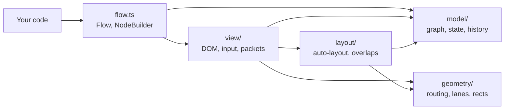

# betternodes

[](LICENSE)


A small, framework-agnostic node graph viewer and editor. Define nodes and wires in code with a
fluent API, show them read-only, or let users edit them drawio-style. Every user edit is reported
as JSON, so you can persist it wherever you like.

```ts
const f = flow(document.getElementById('graph')!)
f.node('hook').title('Webhook')
f.node('mail').title('Send mail')
f.connect('hook', 'mail', { label: 'new order' })
```

## Contents

- [Features](#features)
- [Installation](#installation)
- [Quick start](#quick-start)
- [Guide](#guide): modes, anchors, wires, layout, state, packets, custom content, frameworks
- [API reference](#api-reference)
- [Editor controls](#editor-controls)
- [Persistence](#persistence)
- [Theming](#theming)
- [Performance](#performance)
- [Browser support](#browser-support)
- [Architecture](#architecture)
- [Development](#development)
- [Contributing](#contributing)
- [License](#license)

## Features

- **Zero runtime dependencies**, about 12.6 kB minified and gzipped (plus 1.5 kB of CSS).
- **Plain DOM and SVG**, so it works with React, Vue, Svelte or no framework at all. Node content
  is any element you hand it.
- **View and edit modes.** Read-only by default; in edit mode users drag wires between eight
  connection points per node, move single nodes or selected groups, reconnect and delete wires and
  nodes, with undo and redo.
- **Right-angled wires** with rounded corners that route around nodes, spread out side by side when
  they share a corridor, and carry optional plain-text notes.
- **Automatic layout** in columns that follow the wires, and nodes that never stay on top of each
  other, even when their content grows.
- **Animated packets** that travel along the wires to show data flowing through the graph.
- **JSON state and diffs** for every user edit, ready to save to `localStorage` or a REST API.
- **Minimap** for finding your way around big graphs.
- **Smooth with 1000+ nodes:** DOM writes are batched into one animation frame, and dragging only
  touches the moved nodes and the wires near them.
- **Hooks for your UI:** click, double-click, context-menu and hover events on nodes and wires, a
  viewport API to save and restore pan and zoom, and a `canConnect` check for wires users draw.
- **Configurable:** turn wheel zoom, panning, selection, editor keys, undo and single edit rights
  on or off, when mounting or any time later.
- **Typed wire ends:** in TypeScript, `f.connect('a.x', 'b')` fails to compile with a list of the
  valid anchors.

## Installation

betternodes is not on npm yet. Install it straight from GitHub:

```sh
npm install --allow-git=root github:virtualtear/betternodes#v0.1.0
```

npm 12 and later refuse git dependencies unless you allow them; `--allow-git=root` allows the ones
you list in your own `package.json`. To skip the flag on every install, put `allow-git=root` in
your project's `.npmrc`. Older npm versions don't need the flag.

npm clones the tag and runs its `prepare` script, which builds `dist/`. That build needs Node.js
20.19+ or 22.12+. npm 12 may then warn that the `prepare` script of betternodes was blocked by
`allowScripts`; the package is already built at that point, so you can ignore the warning. Use
another tag or a commit hash after `#` to pick a different version, or leave it off for the latest
`main`.

The package ships one ES module with TypeScript declarations, and one stylesheet you import
yourself:

```ts
import { flow } from 'betternodes'
import 'betternodes/style.css'
```

## Quick start

```ts
import { flow } from 'betternodes'
import 'betternodes/style.css'

const f = flow(document.getElementById('graph')!) // the element needs a size, e.g. height: 600px

f.node('hook').title('Webhook')
f.node('if').title('IF')
f.node('mail').title('Send mail')
f.connect('hook', 'if').connect('if', 'mail')     // auto-laid out and fitted into view

f.mode('edit')                                      // default is 'view'
f.on('change', state => localStorage.setItem('graph', JSON.stringify(state)))
```

## Guide

### Modes

In view mode the graph is read-only: dragging pans, the wheel zooms, a click selects a node. In
edit mode users can also create, move, reconnect and delete wires and move and delete nodes. Switch
any time with `f.mode('view' | 'edit')`. [Options](#options) turn single parts of this off, such as
wheel zoom or deleting.

### Anchors

Every node has eight connection points named by compass direction: `nw n ne e se s sw w`. A wire
end is either

- **fixed**, written `'nodeId.anchor'` (e.g. `'a.e'`), always attached to that point, or
- **floating**, written as a bare `'nodeId'`. The side facing the other end is picked on every
  render, so the wire follows when nodes move.

In the editor, dropping a wire on a connection point makes a fixed end, dropping it on the node's
body makes a floating one.

### Wires

Wires run at right angles with rounded corners and go around every node they don't connect, like
in drawio. Wires that share a corridor are drawn side by side. When you move a node, its own wires
and any wire it now blocks or frees are re-routed. Wires between the nodes of a dragged group keep
their shape and move along; they are re-routed when the group is dropped. Each wire's route search
is capped, so in very crowded graphs an occasional wire falls back to a simple shape that may pass
behind a node.

Wires can carry a plain-text note:

```ts
f.connect('if', 'mail', { label: 'true' })
f.label('if', 'mail', 'yes')   // change it
f.label('if', 'mail')          // remove it
```

Notes sit on the middle stretch of the wire, away from its ends, so wires that fan out of one
anchor don't stack their notes. They are drawn above all wires and follow theirs when nodes move;
clicking one selects its wire. Like node titles they belong to your code, not to `state()`: a wire
the user deletes keeps its note, so undo brings both back, and a wire whose end the user moves
takes its note along. Wires the user draws have none until you call `f.label()`, e.g. from
`change`.

Wires take CSS classes the same way, for status colours or arrowheads:

```ts
f.connect('if', 'log', { class: 'error' })
f.wireClass('if', 'log', 'error', 'bn-two-way')   // replaces the classes; no names clear them
```

The classes go on the wire's `<g>` and on its note, and like notes they survive deletion and move
with a wire end. Two are built in: `bn-two-way` adds an arrowhead at the start, `bn-no-arrow`
removes both. Put either on the root element to change every wire.

### Layout and fit

Nodes without an explicit position are laid out automatically in columns that follow the wires.
Each node is placed once, on its first render: adding or moving wires later never re-arranges it,
and nodes added later go to the right of the existing graph. Positions from `at()`, from `load()`
or from dragging always win. Call `f.layout()` to re-arrange everything.

On the first render the view zooms (never beyond 100%) and pans so the whole graph is visible. Call
`f.fit()` to do that again later, or `f.fit('a', 'b')` to show just some nodes. To restore where a
user left off, save `f.viewport()` on the `viewport` event and pass it back right after mounting;
it replaces the first fit:

```ts
f.viewport(JSON.parse(localStorage.getItem('view') ?? '{}'))
f.on('viewport', v => localStorage.setItem('view', JSON.stringify(v)))
```

### No overlapping nodes

Nodes never stay on top of each other. When positions from your code or a saved state overlap, or
a node's content grows into a neighbour, the node defined later moves to the nearest free spot
about one grid step (20px) away, and the earlier one stays put. Nodes that merely sit close
together are left alone. These adjustments show up in `state()` but don't fire `change`, since
nobody edited anything.

While the user drags a node it may pass over others; on drop it stays where it is unless it ends
up closer than half a grid step (10px) to another node; then it settles at the nearest spot that
keeps that distance. In a dragged group, only the nodes that end up too close to others move. Node
sizes don't follow the grid, so this rounds the gap to the grid: one step of space counts even
when it measures 19.3px.

### State

Node definitions live in your code. Everything the editor can change is a small JSON object:

```ts
type State = {
  positions: Record<string, [x: number, y: number]>
  edges: [from: string, to: string][]
  removed?: string[] // nodes the user deleted; only present when there are any
}
```

Save it on `change` and restore it with `load()`, see [Persistence](#persistence).

### Packets

`f.send()` animates small dots along the wires, in view and edit mode, to show data moving through
the graph:

```ts
await f.send('hook', 'mail')                         // ['mail'], or [] if it could not get there
await f.send('hook')                                 // flow: end nodes reached, e.g. ['mail', 'log']
f.send('if', 'log', { class: 'error', speed: 400 })  // CSS class on the dot, speed in px per second
```

Packets keep up with edits while they travel: they stay on their wire when nodes are dragged and
the wire re-routes, and when their wire is deleted or moved, or a node is removed, they go back to
the node they last left and continue along another route. If no route is left, they fade out.

### Custom content

`.content(el)` mounts any element below the node's title. The node grows and shrinks with it:
when the content changes size, the node's wires re-route and a neighbour it grows into moves aside.
Call `.content()` again to replace the element, or change the element in place.

A node that shows a photo and swaps it on click, see [Events](#events):

```ts
const img = document.createElement('img')
img.src = photos[0]
img.width = 200
img.height = 140       // final size up front, so layout and fit don't jump when the image loads
img.draggable = false  // a native image drag would cancel the pan or node drag
img.onload = () => f.node('image').class('ok')
img.onerror = () => f.node('image').class('error')
f.node('image').title('Image service').content(img)

f.on('click', ({ node }) => {
  if (node !== 'image') return
  f.node('image').class('busy')
  img.src = photos[Math.floor(Math.random() * photos.length)]
})
```

Tips for interactive content:

- Pressing inside content still pans (view mode) or drags the node (edit mode). To keep a control
  from doing that, stop the event: `button.addEventListener('pointerdown', e => e.stopPropagation())`.
- Editor keys (Delete, Ctrl+Z) never act while focus is inside your content, so inputs are safe.
- Titles are plain text, never parsed as HTML. Content is your own element, so escaping inside it
  is up to you.

The demo page (`npm run dev`) has this image node, with status classes, a packet sent after each
swap and an event console.

### Using a framework

Mount the graph once into a sized element and destroy it on unmount. Render node content with your
framework into a plain element and pass that element to `.content()`.

React:

```tsx
import { useEffect, useRef } from 'react'
import { createRoot } from 'react-dom/client'
import { flow } from 'betternodes'
import 'betternodes/style.css'

export function Graph() {
  const ref = useRef<HTMLDivElement>(null)
  useEffect(() => {
    const f = flow(ref.current!)
    const preview = document.createElement('div')
    const root = createRoot(preview)
    root.render(<Preview />)
    f.node('a').title('Source').content(preview)
    f.node('b').title('Target')
    f.connect('a', 'b')
    const ac = new AbortController()
    f.on('change', save, { signal: ac.signal })
    return () => {
      ac.abort()
      f.destroy()
      root.unmount()
    }
  }, [])
  return <div ref={ref} style={{ height: 600 }} />
}
```

Vue: `createApp(Preview).mount(el)`. Svelte 5: `mount(Preview, { target: el })`. Then
`f.node(id).content(el)`.

## API reference

### `flow(root: HTMLElement, options?: FlowOptions): Flow`

Mounts a graph inside `root`. The element must have a size; betternodes fills it. Starts in view
mode unless `options.mode` says otherwise.

### Options

Every option is optional, and the defaults match the behaviour described in this README. Pass them
when mounting, or change them later with `f.set()`; fields you leave out keep their value.

```ts
// A diagram embedded in a long article: the page keeps scrolling over it.
const f = flow(el, { zoom: false, pan: false })

// An editor where users may arrange nodes but not rewire or delete anything.
f.set({ mode: 'edit', connect: false, remove: false })
```

| Option | Default | What it controls |
| --- | --- | --- |
| `mode` | `'view'` | Mode to start in. In `set()` it switches modes like `f.mode()`. |
| `zoom` | `true` | Zooming with the wheel or a trackpad pinch. When off, wheel events reach the page, so it scrolls past the graph. |
| `minZoom` | `0.1` | Smallest zoom for the wheel and for fitting. |
| `maxZoom` | `4` | Largest zoom for the wheel. Fitting never zooms past 100% either way. |
| `pan` | `true` | Panning by dragging, and scrolling the view while dragging near its edge. |
| `fit` | `true` | Fitting the whole graph into view on the first render. `f.fit()` works either way. |
| `select` | `true` | Selecting by click, Shift+click, selection box and Esc. `f.select()` works either way. |
| `keys` | `true` | Editor keys: Delete, Backspace, Ctrl+Z, Ctrl+Y and Esc. |
| `history` | `100` | How many edits undo can revert. `0` turns undo and redo off. Lowering it later drops the oldest steps. |
| `connect` | `true` | Edit mode: drawing new wires and moving wire ends. When off, connection points are hidden. |
| `move` | `true` | Edit mode: dragging nodes. When off, dragging a node pans, as in view mode. |
| `remove` | `true` | Edit mode: deleting nodes and wires with Delete or Backspace. |
| `snap` | `true` | Snapping dragged nodes to the 20px grid. |
| `minimap` | `false` | An overview of the whole graph in the bottom-right corner. Click or drag in it to pan (unless `pan` is off). |
| `canConnect` | allows all | `(from, to) => boolean`, asked before a wire the user draws or reconnects is made. Ends come as stored: `'node.anchor'`, or a bare id for a floating end. Return false to reject it. |

Options only limit what users can do. Calls from your code, like `f.connect()`, `f.remove()` or
`f.undo()`, work whatever they say, except that `history: 0` leaves nothing to undo. Mounting or
`set()` throws if `minZoom` ends up above `maxZoom`; `set()` then changes nothing.

While any of `connect`, `move` or `remove` is off, the root element carries them in a `data-lock`
attribute, e.g. `data-lock="connect remove"`, so your own CSS can react to it.

### Defining nodes: `f.node(id)`

Returns a builder for a new or existing node. Ids must not contain `.`.

| Method | Description |
| --- | --- |
| `.title(text)` | Title text (plain text, never parsed as HTML). Defaults to the id. |
| `.at(x, y)` | Top-left corner in world pixels. Without it, auto-layout places the node. |
| `.content(el)` | Custom markup below the title. Render it with any framework into a plain element. |
| `.class(...names)` | Extra CSS classes, replacing earlier ones. Handy for status, e.g. `'running'`, `'error'`. |

All builder methods return the builder, so calls chain.

`f.remove(id)` deletes a node and its wires; it throws for unknown ids. A deleted node is listed in
`state().removed`, so a saved state keeps it deleted after a reload even though your code still
defines it. Calling `f.node(id)` for a deleted node does not bring it back; undo or `load()` do.

### Wires

| Method | Description |
| --- | --- |
| `f.connect(from, to, { label, class })` | Adds a wire, optionally with a note and a CSS class. Throws for unknown nodes or anchors, both ends on one node, or a duplicate. |
| `f.disconnect(from, to)` | Removes a wire. Throws if it does not exist. |
| `f.label(from, to, text?)` | Sets the note on a wire, or removes it without `text`. Throws if the wire does not exist. |
| `f.wireClass(from, to, ...names)` | Sets the wire's CSS classes, replacing earlier ones; no names clear them. Throws if the wire does not exist. |

Ends are `'nodeId.anchor'` or a bare `'nodeId'`. String literals are checked at compile time;
other strings are validated at runtime.

### Packets

| Call | What travels |
| --- | --- |
| `f.send(from, to, opts?)` | One packet to `to` over the fewest hops, following wire direction. It picks each next wire when it reaches a node, so edits made meanwhile count. Between neighbours this is simply the direct wire. |
| `f.send(from, undefined, opts?)` | A flow: at every node the packet splits along each outgoing wire, using every wire at most once per send (so cycles end). |

`opts` is `{ class?: string, speed?: number }`: a CSS class on the dot, and the speed in world px
per second (default 240). `send()` returns a promise of the node ids reached: `[to]` or `[]` for
one packet, and for a flow the end nodes reached, meaning nodes without outgoing wires. Sending
throws for unknown node ids and never emits `change`, since packets are not part of the saved
state.

### Selection

```ts
f.on('select', ({ nodes, wire }) => {
  if (nodes.length === 1) inspector.show(nodes[0])
  else inspector.hide()
})
```

| Method | Description |
| --- | --- |
| `f.on('select', selection => {}, { signal })` | Called whenever the selection changes, in both modes. `selection` is `{ nodes: string[], wire?: [from, to] }`: any number of nodes, or one wire. |
| `f.select(...ids)` | Selects these nodes, replacing the selection; no ids clear it. Throws for unknown ids. |
| `f.selection()` | The current selection, as passed to `select` listeners. |

Unlike `change`, `select` also fires for changes made in code: `f.select()`, removing a selected
node, undo, and `f.mode()`, which clears the selection. It never fires when the selection stayed
the same, so calling `f.select()` from a listener is safe.

### Events

```ts
f.on('click', ({ node, wire }, event) => {
  if (node) inspector.show(node)
})
f.on('contextmenu', (hit, event) => {
  event.preventDefault()   // no browser menu
  menu.open(hit, event.clientX, event.clientY)
})
```

| Event | Listener gets | Fires when |
| --- | --- | --- |
| `click` | `(hit, event)` | A press and release that moved less than 4px, so drags never count. Fires after the selection it made. |
| `dblclick`, `contextmenu` | `(hit, event)` | The browser's events of the same name. |
| `hover` | `(hit)` | The pointer moves onto another node or wire, or off them (`{}`). |
| `viewport` | `({ x, y, zoom })` | Pan or zoom changed, by the user or by code; at most once per frame. |

`hit` is `{ node }`, `{ wire: [from, to] }`, or `{}` for the background. These events fire in both
modes and whatever the [options](#options) say, so `select: false` plus `click` lets you build your
own selection.

### Everything else

| Method | Description |
| --- | --- |
| `f.mode('view' \| 'edit')` | Switches modes. |
| `f.set(options)` | Changes [options](#options) while the graph is shown. |
| `f.state()` | Current `State`. |
| `f.load(state)` | Restores positions and wires from a saved `State`. `null` is a no-op. Saved wires whose nodes or anchors no longer exist are dropped with a console warning. |
| `f.on('change', (state, diff) => {}, { signal })` | Called after every user edit, including undo and redo. Never called for changes made in code. The optional `signal` unsubscribes when aborted. |
| `f.undo()` / `f.redo()` | Reverts or re-applies a user edit and emits `change`. Keeps the last 100 edits unless the `history` option says otherwise. |
| `f.layout()` | Re-arranges every node (including positioned ones) into columns that follow the wires, using current node sizes. Takes effect immediately, emits no `change`. |
| `f.fit(...ids)` | Zooms and pans so these nodes, or with no ids all of them, are visible. Applies on the next frame. Throws for unknown ids. |
| `f.viewport()` | The current `{ x, y, zoom }`: where the world origin sits in screen px, and the zoom factor. |
| `f.viewport({ x?, y?, zoom? })` | Pans and zooms; left-out fields stay. Called right after mounting it replaces the first fit. |
| `f.zoomBy(factor)` | Zooms around the middle of the view, within `minZoom` and `maxZoom`, e.g. `1.2` in, `1 / 1.2` out. |
| `f.destroy()` | Removes everything betternodes added to `root`, including listeners. |

Undo restores the state from just before an edit, so changes your code made after that edit are
reverted too.

### Exported types

`Flow`, `NodeBuilder`, `FlowOptions`, `State`, `Diff`, `Edge`, `Anchor`, `End`, `Selection`, `Hit`,
`Viewport` and `SendOptions`.

## Editor controls

| Action | How |
| --- | --- |
| Pan | Drag the background (in view mode, drag anywhere). The selection stays. |
| Zoom | Mouse wheel or trackpad pinch, centered on the pointer. |
| Select | Click a node or wire; in view mode only nodes. Esc or a click on empty space deselects. |
| Select several nodes | Shift+click a node to add or remove it. Shift+drag on the background draws a box; every node it touches is added. |
| Move nodes | Drag a node. If it is selected, every selected node moves along. Positions snap to the 20px grid. Nodes can pass over each other while you drag. A node stays where you drop it unless that is closer than 10px to another node; then it moves to the nearest spot with room. Clicking one node of a group selects just that node. |
| Minimap | With the `minimap` option, click or drag in the overview to move the view there. |
| Scroll while dragging | While dragging a node, a wire end or a selection box, move the pointer near the edge of the graph; the view scrolls that way, faster closer to the edge. |
| New wire | Hover a node, drag from one of its connection points to another node. Points show at 50% zoom or more. |
| Move a wire end | Press on a wire near the end you want to move and drag it elsewhere. Dropping on empty space puts it back. |
| Select all | Ctrl+A (Cmd+A on macOS). |
| Nudge | Arrow keys move the selected nodes one grid step (1px with `snap: false`). Each press is one undo step. |
| Delete | Select a wire or nodes, then Delete or Backspace. Nodes take their wires with them, and one undo brings them all back. |
| Undo / redo | Ctrl+Z / Ctrl+Shift+Z or Ctrl+Y (Cmd on macOS). |

Keys only act while the graph has focus (clicking inside it gives focus), and never while typing
inside your own node content. Each of these controls can be turned off with [options](#options).

## Persistence

Save the whole state:

```ts
f.load(JSON.parse(localStorage.getItem('graph') ?? 'null'))
f.on('change', state => localStorage.setItem('graph', JSON.stringify(state)))
```

Or send only what changed, for example to a REST API:

```ts
f.on('change', (_, diff) => api.patch('/graph', diff))
// diff = { added: [['a.e', 'b']], removed: [], moved: { a: [120, 60] }, nodesRemoved: [], nodesRestored: [] }
```

`f.layout()` emits no `change`, so save `f.state()` yourself after calling it.

## Theming

Override these CSS variables on `.bn` or on your root element:

| Variable | Default | Used for |
| --- | --- | --- |
| `--bn-bg` | `#f6f7f9` | Canvas background |
| `--bn-grid` | `#dde1e6` | Grid dots |
| `--bn-node-bg` | `#fff` | Node background |
| `--bn-node-border` | `#c9ced6` | Node outline |
| `--bn-text` | `#1f2328` | Text |
| `--bn-accent` | `#ff6d5a` | Connection points, selected wire, wire being dragged |
| `--bn-wire` | `#9aa3ae` | Wires |
| `--bn-packet` | `--bn-accent` | Packet dots (`.bn-packet`) |
| `--bn-radius` | `8px` | Node corner radius |
| `--bn-anchor` | `10px` | Connection point size |
| `--bn-minimap-bg` | `#fffc` | Minimap background |
| `--bn-minimap-node` | `#c9ced6` | Nodes in the minimap |
| `--bn-minimap-view` | `--bn-accent` | Visible-area box in the minimap |

Nodes are `.bn-node` elements with a `.bn-title`; style them, or the classes you add with
`.class()`, like any other HTML. Selected nodes and wires get `.bn-selected`, and the selection box
is a `.bn-band` element. Wire notes are SVG `.bn-label` text with a halo in `--bn-bg`. Each wire is
a `<g data-wire>` holding a `.bn-wire` path, and gets the classes from `wireClass()`. The minimap is
an SVG `.bn-minimap` (place or size it with CSS) whose `.bn-mini-node` rects carry each node's
classes, so `.bn-mini-node.error` can colour a status. A packet
sent with `{ class }` gets that class next to `.bn-packet`:

```css
.bn-node.error { box-shadow: 0 0 0 2px #e5484d; }
.error .bn-wire { stroke: #e5484d; }
.bn-label { font-style: italic; }
.bn-packet.error { fill: #e5484d; }
```

## Performance

Measured with `npm run bench` in headless Chromium on a laptop. Each benchmark fails if its median
exceeds the budget, which is set at several times the measured value to catch regressions. Frame
rate rows drive real animation frames with real pointer events, so they include the browser's own
layout and paint work; they fail below their budget. The browser caps them at the display rate, so
60 fps means no frame was missed.

| Scenario | Median | Budget |
| --- | --- | --- |
| Mount 1000 nodes and 970 wires (first frame) | 124 ms | 500 ms |
| Frame while dragging a node, 1000 nodes | 0.9 ms | 8 ms |
| Frame while dragging 100 selected nodes, 1000 nodes | 1.7 ms | 8 ms |
| Same, with the minimap on (includes a forced layout the benchmark causes, not real frames) | 3.6 ms | 8 ms |
| Frame while dragging all 1000 nodes | 3.5 ms | 8 ms |
| Frame while panning, 1000 nodes | < 0.1 ms | 8 ms |
| Frame with 200 packets in flight, 1000 nodes | 1.3 ms | 8 ms |
| Route 1000 short wires | 11 ms | 50 ms |
| Route 300 long random wires among 200 nodes (worst case) | 163 ms | 600 ms |
| Spread 1000 wires into lanes | 0.3 ms | 5 ms |
| Auto-layout 1000 nodes | 0.4 ms | 5 ms |
| Overlap check, 1000 nodes all changed | 0.4 ms | 5 ms |
| Pull apart 300 nodes stacked on one spot | 84 ms | 400 ms |
| Frame rate while dragging a node, 1000 nodes | 60 fps | 30 fps |
| Frame rate while panning, 1000 nodes | 60 fps | 30 fps |
| Frame rate with 200 packets in flight, 1000 nodes | 60 fps | 30 fps |

Why it stays fast:

- DOM writes for a frame are batched into one `requestAnimationFrame`, and the browser lays the
  page out at most once per frame (all writes first, then all reads).
- Panning and zooming change one CSS transform. Dragging re-places only the dragged nodes and
  re-routes only the wires near them; wires inside a dragged group are shifted, not re-routed.
  Scrolling at the edge during a drag runs frames only while the pointer is there.
- Most wires take a straight, L or Z route without searching; only wires blocked by other nodes run
  a route search, capped per wire so one wire never stalls a frame. The search estimates both the
  distance and the bends still needed, so it rarely runs out before finding a way around.
- Frames where no node moved and no wire changed (panning, packets) skip wire work entirely.
- Packets advance in one pass per frame and plan their next hop from a cached wire index.
- Nothing runs while the graph is idle.

Known costs: graphs with many long wires crossing a crowded area take noticeably longer on first
render (see the worst-case row), and pulling apart hundreds of nodes stacked on one spot takes
around a second for 1000 nodes.

## Browser support

Current Chrome, Edge, Firefox and Safari. Arrowheads use `fill: context-stroke`.

## Architecture

### Technology stack

| Part | Tool |
| --- | --- |
| Language | TypeScript 7, strict mode, ES2023 target |
| Runtime | Plain DOM and SVG, no dependencies |
| Build | Vite 8 in library mode (one ES module), `tsc` for declarations |
| Tests | Vitest 5 browser mode in headless Chromium via Playwright |
| Benchmarks | Vitest in the same browser, with a time budget per scenario |

### Layers

`model/` and `geometry/` import nothing outside themselves, `layout/` builds on both, `view/` on
all three, and `flow.ts` ties them together. Only `view/` touches the DOM, so everything below it is
plain data and math that tests can check without rendering.



```
src/
  index.ts          public exports
  flow.ts           Flow facade and NodeBuilder: the public API
  options.ts        FlowOptions, their defaults and merging
  style.css         default look, themed with CSS variables
  model/            graph data, saved state, diffs, undo history
  geometry/         pure math: rects, spatial hash, min-heap, wire routing, lanes, SVG path data
  layout/           pure node placement: auto-layout columns, pulling overlaps apart
  view/             DOM: frame scheduler and nodes, wires, pointer and keyboard input, packets
test/               browser tests, plus compile-time type checks in types.check.ts
bench/              performance benchmarks with budgets
index.html          demo page served by `npm run dev`
```

### One frame

API calls and user input only mark what changed and request a frame. Each frame then runs in a
fixed order, so the browser lays the page out once:

1. **Write:** apply the viewport, rebuild changed nodes, move nodes to their new positions.
2. **Read:** measure nodes whose size may have changed.
3. **Place:** auto-layout nodes that have no position yet, pull apart overlapping nodes, and fit
   the view on the first render.
4. **Wires:** re-route only the wires touched by moved or resized nodes, spread shared corridors
   into lanes, and draw notes.
5. **Overlays:** wire preview, selection box and selection highlight, then packets advance.

## Development

Requires Node.js 20.19+ or 22.12+.

```sh
git clone https://github.com/virtualtear/betternodes.git
cd betternodes
npm install                   # also builds dist/ via the prepare script
npx playwright install chromium   # once, for tests and benchmarks
```

| Script | What it does |
| --- | --- |
| `npm run dev` | Demo page at http://localhost:5173 |
| `npm test` | Type checks, then browser tests in headless Chromium |
| `npm run test:watch` | Tests in watch mode |
| `npm run bench` | Performance benchmarks with budgets, printed as a table |
| `npm run build` | `dist/index.js`, `dist/index.d.ts`, `dist/style.css` |

The demo page shows most features in one place: a sample flow with wire notes and status classes,
an "Image service" node whose photo swaps on click, buttons for edit mode, undo, redo, packets,
layout and fit, and an event console that logs every `select`, `change` and arrived packet. Add
`?n=1000` to the URL for a stress test with a live fps display. The demo saves its state to
`localStorage`; "Reset saved state" clears it.

### Testing

- `test/*.test.ts` run in real headless Chromium (Vitest browser mode with Playwright), so they
  cover layout, measuring and pointer input as users see them. They cover the API, routing and
  geometry, pointer and keyboard interaction, wire notes and packets.
- `test/types.check.ts` is never executed. `tsc` compiles it as part of `npm test`, and
  `@ts-expect-error` lines prove that invalid anchors fail to compile.
- `bench/perf.bench.ts` fails when a scenario exceeds its budget. Run it before and after changes
  to hot paths: rendering, routing, layout, dragging and packets.

### Coding standards

- TypeScript in strict mode with `verbatimModuleSyntax`; type-only imports use `import type`.
- Keep the layers: no DOM access outside `view/`, and no imports from a higher layer.
- No runtime dependencies.
- DOM writes go through the frame scheduler: mark what changed and let the next frame write it.
  Never read layout in the middle of writes.
- Every exported declaration gets a one-line TSDoc summary. Comments explain why, not what.
- User-facing errors start with `betternodes:` and name the offending id or wire.
- Text from callers (titles, notes) is set as plain text, never as HTML.

## Contributing

1. Fork the repository and create a branch from `main`.
2. Make your change, with tests in `test/` for new behaviour.
3. Run `npm test`, and `npm run bench` if you touched a hot path.
4. Update this README when the public API or behaviour changes.
5. Write commit messages in the [Conventional Commits](https://www.conventionalcommits.org) format,
   e.g. `feat: add wire colors`, `fix(routing): avoid zero-length segments`.
6. Open a pull request against `main`.

Bug reports are welcome in the [issue tracker](https://github.com/virtualtear/betternodes/issues);
a small graph that reproduces the problem helps most.

## License

[MIT](LICENSE)
