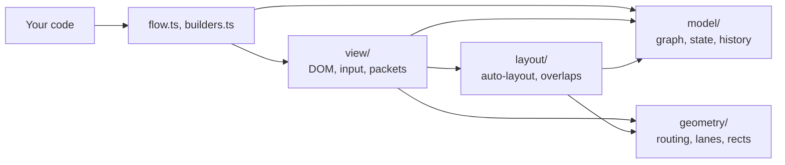
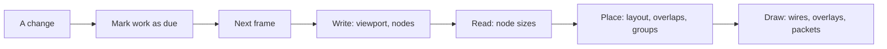

# How betternodes works

These notes explain how betternodes is put together and why. They are for anyone who wants to
change the code, or who wonders why the library behaves the way it does. The public API is in the
[README](README.md).

## The main ideas

Nodes are plain HTML elements and wires are SVG paths. There is no framework underneath and no
runtime dependency, so the library works in any page.

All DOM work waits for the next animation frame, and inside that frame every write happens before
any read. A frame only touches what changed: dragging a node re-routes the wires near it and leaves
the others alone.

Routing tries cheap shapes before it searches. Straight, L and Z shapes cover most wires, and the
A* search that handles the rest has a hard cap on its work.

Node definitions live in your code. The editor state only holds what users can change, which keeps
it small enough to save as JSON. Anything that comes in from outside, whether a saved state or an
API argument, is checked before it touches the graph.

Every hot path has a benchmark with a time budget, and the benchmarks run in a real browser.

## Stack

| Part | Tool |
| --- | --- |
| Language | TypeScript 7, strict, ES2024 |
| Runtime | DOM, SVG and WebGL2, no dependencies |
| Build | Vite 8 library mode, `tsc` for type declarations |
| Tests and benchmarks | Vitest 5 browser mode, headless Chromium through Playwright |

A graph editor is often embedded in a larger app, and every dependency would add size and a chance
of version conflicts to that app. The hard parts (routing, layout, spatial hashing) are small
enough to own and tune by hand.

## Layers

The code is split into four layers, and each one only imports from the layers below it. Only
`view/` touches the DOM.



```
src/
  index.ts          public exports
  flow.ts           Flow, the public API
  builders.ts       NodeBuilder and GroupBuilder
  check.ts          input checks shared by the API
  types.ts          public types
  options.ts        options, defaults and checks
  style.css         default look
  model/            graph, saved state and diffs, undo history
  geometry/         rects, spatial hash, heap, routing, lanes, SVG paths
  layout/           auto-layout and pulling overlaps apart
  view/             frame loop, nodes, wires, groups, minimap
    input/          pointer and keyboard input
    packets/        packets and their WebGL renderer
test/               browser tests and compile-time type checks
bench/              benchmarks with budgets
index.html          demo page
```

`model/` and `geometry/` are plain data and functions, so they run and test without a DOM. Routing
and layout know nothing about rendering, which lets either side change without the other.

## The frame loop

Reading layout, for example with `getBoundingClientRect()`, right after a DOM write forces the
browser to lay out the page on the spot. A frame that mixes reads and writes across 1000 nodes can
end up doing 1000 layouts instead of one. This is usually called layout thrashing, and the frame
loop exists to avoid it.

Calls like `node()`, `place()` or a drag don't touch the DOM. They add the node's id to one of
three sets:

- `dirty`: rebuild the node (title, content, anchors)
- `moved`: update its position and classes
- `stale`: measure its size again

Then they call `update()`, which schedules one `requestAnimationFrame` however many changes come in
before it runs. A `ResizeObserver` also marks nodes as stale when their content grows.



The frame does all of its writes first, then measures the stale nodes, then places them and draws
wires, overlays and packets. Nothing reads layout after the measuring step, so the browser lays out
once per frame.

Panning changes a single CSS transform on the world element and leaves the nodes alone. Below 50%
zoom, a `bn-far` class hides the anchors: they are too small to grab at that size, and thousands of
them on screen slow panning down. When nothing changes, no frame runs at all.

## Graph and state

Your code and the editor own different parts of the graph:

| Your code | The editor state |
| --- | --- |
| Titles, content, node classes | Node positions |
| Wire notes and wire classes | Wires |
| Groups | Nodes the user deleted |

```ts
type State = {
  positions: Record<string, [x: number, y: number]>
  edges: [from: string, to: string][]
  removed?: string[]
}
```

Your code stays the single source of truth for what a node is, and the saved state stays small,
plain JSON. Each `change` event carries the full state and a `Diff`, so a server can store just
what changed. `change` only fires for user edits, never for your own calls, so saving on `change`
can't start a loop.

A wire end is written as `'node.anchor'` or just `'node'` and split at the first dot. A wire's key
in the graph's maps is `'from>to'`. That's why node ids can't contain `.` or `>`: with `>` allowed,
a wire from `a` to `b>c` and one from `a>b` to `c` would get the same key.

`Graph.version` goes up on every structural change, such as adding or removing a wire. The renderer
compares it with the version it last drew. If it's the same and nothing moved, there is no wire
work to do.

## Undo

Before each user edit, the current `State` goes onto a stack that holds up to `history` entries
(100 by default). Undo and redo load a snapshot through the same checked `load()` path that saved
data uses, and only the nodes whose position changed get placed again. On a 1000-node graph,
undoing a one-node move takes 2.8 ms. Each arrow-key press is its own undo step.

Snapshots are stored whole rather than as diffs because a snapshot is always correct. Diffs would
need an inverse for every kind of edit, and each inverse is one more place for a bug. The price is
memory, roughly `history` times the size of one state.

## Routing wires

A wire is routed in these steps:

1. It leaves its anchor in a straight 20px stub, shorter if a neighbour is close.
2. Only nodes in a region around the wire count as obstacles.
3. Five cheap shapes are tested: straight, two L shapes and two Z shapes. The cheapest one that
   isn't blocked wins.
4. If all five are blocked, an A* search looks for a way around.
5. Steps 3 and 4 run first with 10px of space around each node, then again with 2px if nothing
   fits.
6. If that fails too, the wire is drawn as a simple Z shape that may pass behind a node. A wire is
   always drawn.

A route costs its length plus 40px for every bend, which favours fewer, longer segments.

The A* search runs on a sparse grid whose lines only go through node edges, the two stub ends and
the midpoint between them, so the grid stays small. A search state is a grid point plus a direction
of travel, which lets turns cost extra. The estimate of the remaining cost adds the bends any path
still needs to the distance. With no obstacles in the way that estimate is exact, so A* still finds
the cheapest route while exploring far fewer states. The search gives up after 8000 steps, which
keeps the slowest wire to roughly one frame. A grid of more than about 4 million cells isn't
searched at all, and the Z fallback is used instead.

A search can reach about 24,000 states at most, however big its grid is. All searches therefore
share one table with 65,536 slots, about 1.4 MB, instead of allocating arrays the size of the grid.
For one long wire across 1000 scattered nodes, grid-sized arrays would take 143 MB and 70 ms just
to fill. Each search gets an id, and a slot written by an older search counts as empty, so the
table is never cleared between searches. Small grids use the state number directly as the slot;
larger ones use Fibonacci hashing with linear probing.

Wires that would run on top of each other are spread into lanes side by side, up to 6px apart.
Only the middle segments move, so wires still start and end exactly on their anchors. The whole
spread stays inside the clearance band, so no lane touches a node.

## Skipping work that didn't change

Each frame works out what a change could have affected and skips the rest:

| When | What gets skipped |
| --- | --- |
| Nothing moved and the graph version is unchanged | All wire work |
| One node is dragged | Wires whose box doesn't touch its old or new spot |
| Several nodes are dragged together | Re-routing wires between two of them; those wires move along |
| A wire's points didn't change | Its SVG path string and its packet track |
| A node's title or content didn't change | Its DOM, so focus in an input stays put |
| A node's classes didn't change | Writing its `className` |
| Undo, redo or `load()` | Nodes whose position stayed the same |
| Nothing was measured this frame | Auto-layout |

Wire notes are sized from their text length, at 6.5px per character, because measuring them would
cost a layout per note. The minimap reuses its group rectangles instead of creating new ones every
drag frame. Removing many nodes walks the wire list once instead of once per node, so removing 1000
nodes takes 0.2 ms.

## The spatial hash

The spatial hash answers "what is near this rectangle?" without looking at every node. It is a grid
of 256px buckets, and each rectangle goes into every bucket it touches. Bucket keys are numbers
(`cx * 1_000_003 + cy`) rather than strings, so a lookup builds no strings. That matters because
overlap removal runs thousands of lookups.

Some rectangles are never walked bucket by bucket. Anything wider or taller than 64 buckets, or with
coordinates beyond 2^50, goes into a separate list that is checked one entry at a time. Past 2^50,
`cx++` no longer changes the number, and a loop over the cells would never end. Queries over huge
areas scan only the buckets that exist. Together, these limits keep the work bounded for any input,
`Infinity` included.

The hash keeps its own private copy of the rectangle overlap check. Sharing that function with the
router made it polymorphic in V8, and free-spot searches measured about 60% slower.

## Layout and overlap removal

Auto-layout puts each node in a column given by the longest wire path leading into it. Inside a
column, nodes keep the order they were added in, and columns are centred vertically. Each group
gets its own horizontal band so its frame never reaches over other nodes. Nodes added later go to
the right of the existing ones. A node is only laid out once, and positions from `at()`, `load()`
or a drag always win.

The longest-path walk uses an explicit stack instead of recursion. Recursion would overflow the
call stack on a chain of a few thousand nodes wired against insertion order, and a saved state can
contain such a chain. When the walk closes a cycle, that wire counts as coming from depth -1, which
ends the cycle.

When nodes end up on top of each other, the spatial hash finds the overlapping pairs, looking only
at nodes that changed. Of each pair, the node defined later moves. It searches the grid ring by ring
for the nearest free spot, up to 500 rings out, so even hundreds of stacked nodes find room. Nodes
being dragged are left alone until they are dropped.

## Packets

Each packet dot is a WebGL2 point sprite with 32 bytes of data. A frame uploads one buffer and makes
one draw call, however many dots there are. Without WebGL2, dots fall back to SVG circles.

Dots are still styled with CSS. Hidden probe circles get each packet class, and their computed
`fill`, `stroke`, `stroke-width` and `r` become the dot's look. The looks are read again every
frame, so a theme switch also recolours dots that are already moving.

To move a dot along a wire, the renderer needs the point at a given distance. The browser's
`getPointAtLength()` takes about 15 µs per call, which is too slow for thousands of dots a frame.
A `Track` turns the rounded wire into a polyline that stays within 0.1px of the curve and finds
points on it with a binary search. Each packet stores its progress as a fraction from 0 to 1, so
when its wire re-routes, it stays at the same fraction of the new path. If the wire is deleted, the
packet re-plans from the node it left, and it fades out when no route is left.

A frame step is capped at 100 ms, so packets don't jump ahead when a background tab comes back.
The WebGL context is released after 2 seconds without dots, since browsers allow only about 16
contexts per page. With `prefers-reduced-motion` set, dropped dots disappear without a fade.

## Pointer input

Gestures listen on `window`, so moves and the drop register wherever the pointer goes.
`setPointerCapture` isn't used because it would retarget `pointerup` to the drag source. Holding a
drag within 40px of the border pans the view, at a speed based on elapsed time rather than frame
rate. A press that moves less than 4px counts as a click.

## Input checks

Everything from outside is checked where it enters, before anything changes, and no input can make
the work or memory grow without limit.

| Input | Check | Without the check |
| --- | --- | --- |
| `load(state)` | Shape, numbers within ±10,000,000, wires as string pairs | `1e309` in JSON becomes `Infinity`, and loops over it never end |
| `at()`, `viewport()`, `zoomBy()` | Finite numbers, zoom above 0 | The same endless loops, or a broken view |
| CSS class names | Not empty, no whitespace | `classList.add()` throws inside a frame, and rendering stays broken |
| `send()` speed | Finite and above 0 | A speed of 0 never arrives, so the animation runs forever |
| Node ids | No `.` or `>` | Two different wires can share one key |
| Options | Zoom above 0, min not above max, whole-number history | Broken zoom or undo |

`load()` checks the whole state before it touches the graph, so it never leaves a half-loaded graph
behind. A state that isn't shaped like `{ positions, edges }` is rejected as a whole. Bad entries
inside a valid state are dropped with one warning per list rather than one per entry, so a huge
crafted list can't flood the console.

Titles and notes are set with `textContent`, never `innerHTML`. The event target is private, so
other code can't fire fake `change` events. After `destroy()`, no more frames run and `send()`
resolves with `[]`. Every error message starts with `betternodes:`.

The type system checks wire ends too. `End<S>` is a template literal type, so a literal such as
`'a.x'` fails to compile, because `x` isn't an anchor. Strings that are only known at runtime are
checked at runtime.

## Tests and benchmarks

Tests run in headless Chromium through Vitest's browser mode, not in a simulated DOM, so layout,
`ResizeObserver` and WebGL behave the way they do for users. `test/types.check.ts` is compiled but
never run. Its `@ts-expect-error` lines prove that wrong calls fail to compile.

`npm run bench` measures medians in the same headless Chromium, and a scenario fails when it goes
over its budget. Frame budgets are 8 ms, about half of a 60 fps frame (16.7 ms), which leaves the
rest for the browser and the host app.

| Scenario | Median | Budget |
| --- | --- | --- |
| Mount 1000 nodes and 970 wires | 137 ms | 500 ms |
| Frame while dragging a node, 1000 nodes | 0.7 ms | 8 ms |
| Frame while dragging 100 nodes, 1000 nodes | 1.2 ms | 8 ms |
| Same, minimap on | 4.2 ms | 8 ms |
| Frame while dragging all 1000 nodes | 3 ms | 8 ms |
| Frame after undoing a move, 1000 nodes | 2.8 ms | 10 ms |
| Frame while panning, 1000 nodes | < 0.1 ms | 8 ms |
| Frame with 1000 packets on bent wires | 0.2 ms | 8 ms |
| Route 1000 short wires | 12.1 ms | 50 ms |
| Route 300 long wires among 200 nodes (worst case) | 94 ms | 600 ms |
| Route 10 long wires across 1000 scattered nodes | 90 ms | 300 ms |
| Remove 1000 nodes at once | 0.2 ms | 2 ms |
| Auto-layout 1000 nodes | 0.5 ms | 5 ms |
| Pull apart 300 nodes stacked on one spot | 85 ms | 400 ms |
| Frame rate while dragging or panning, 1000 nodes | 60 fps | 30 fps |
| Frame rate with 2000 packets in flight | 60 fps | 30 fps |

## Development

```sh
git clone https://github.com/virtualtear/betternodes.git
cd betternodes
npm install                       # also builds dist/
npx playwright install chromium   # once, for tests and benchmarks
```

| Script | What it does |
| --- | --- |
| `npm run dev` | Demo page at http://localhost:5173 |
| `npm test` | Type checks, then browser tests |
| `npm run test:watch` | Tests in watch mode |
| `npm run bench` | Benchmarks with budgets |
| `npm run build` | `dist/index.js`, `dist/index.d.ts`, `dist/style.css` |

The demo has edit mode, undo, packets and an event log. Add `?n=1000` to the URL for a stress test
with an fps counter.

If you change anything on a hot path, run `npm run bench` before and after. No row should get more
than 5% slower, and if a number looks like noise, run it again.

The code follows a few rules:

- Strict TypeScript, with `import type` for type-only imports.
- The layers stay intact: no DOM outside `view/`, and no imports from a higher layer.
- No runtime dependencies.
- DOM writes go through the frame loop, and layout is never read between writes.
- Changes don't add allocations to code that runs every frame.
- Public API input is checked where it enters.
- Exported declarations get a one-line TSDoc summary, and comments explain why rather than what.

## Known limits

betternodes is built for graphs of up to a few thousand nodes. This table lists where it should
slow down first as graphs grow, and what the next step would be.

| Limit | When it starts to matter | Next step |
| --- | --- | --- |
| Route obstacles are scanned one by one | Around 2000 nodes | A spatial index for obstacles |
| All wires are scanned when something changes | Around 5000 wires | An index from each node to its wires |
| No crossing minimization in auto-layout | Dense, tangled graphs | A layered layout such as elkjs or dagre |
| Undo stores whole snapshots | Very large graphs with deep history | Store inverse diffs |
| Note placement checks every node per spot | Many notes on large graphs | Use the spatial hash for notes |
