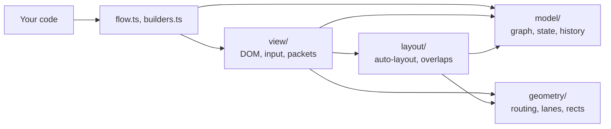
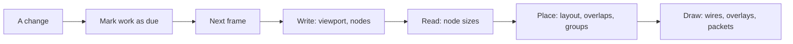

# How betternodes works

This file explains how betternodes is built and why it is built that way.

**How to read it:** every section starts with an **In short** line. Read only those for a
two-minute tour, and open a section when you want the details.

## Contents

1. [The short version](#1-the-short-version)
2. [Tech stack](#2-tech-stack)
3. [Layers and folders](#3-layers-and-folders)
4. [The frame loop](#4-the-frame-loop)
5. [Data model](#5-data-model)
6. [Undo and redo](#6-undo-and-redo)
7. [Wire routing](#7-wire-routing)
8. [Redrawing only what changed](#8-redrawing-only-what-changed)
9. [The spatial hash](#9-the-spatial-hash)
10. [Layout and overlaps](#10-layout-and-overlaps)
11. [Packets](#11-packets)
12. [Input and safety](#12-input-and-safety)
13. [Testing and benchmarks](#13-testing-and-benchmarks)
14. [Development](#14-development)
15. [Known limits](#15-known-limits)

---

## 1. The short version

> **In short:** plain DOM and SVG, one batched frame, cheap work first, bounded work always.

- **No framework, no dependencies.** Nodes are HTML elements, wires are SVG paths. It works anywhere.
- **One frame at a time.** Every change waits for the next animation frame, so the browser lays
  out once per frame.
- **Do only what changed.** A drag re-routes only the wires near the moving node.
- **Cheap first, expensive last.** Most wires are straight, L or Z shapes. A* runs only when those
  are blocked.
- **Your code owns the graph.** The editor state is only what users can change, as small JSON.
- **Every input is checked where it enters.** Bad saved data cannot hang the tab.
- **Measured, not guessed.** Every hot path has a benchmark with a time budget.

---

## 2. Tech stack

> **In short:** TypeScript and browser APIs only. Tests run in a real browser.

| Part | Tool |
| --- | --- |
| Language | TypeScript 7, strict, ES2024 |
| Runtime | DOM, SVG and WebGL2, no dependencies |
| Build | Vite 8 library mode, `tsc` for type declarations |
| Tests and benchmarks | Vitest 5 browser mode, headless Chromium through Playwright |

**Why no dependencies?**
- A graph editor is often embedded in a larger app. Every dependency adds size and a chance of
  version conflicts for that app.
- The few hard parts (routing, layout, spatial hashing) are small enough to own and tune.

---

## 3. Layers and folders

> **In short:** four layers that only import downward. Only `view/` touches the DOM.



```
src/
  index.ts          public exports
  flow.ts           Flow, the public API
  builders.ts       NodeBuilder and GroupBuilder
  check.ts          input checks shared by the API
  types.ts          public types
  options.ts        options, defaults and checks
  style.css         default look
  model/            graph, saved state and diffs, undo history
  geometry/         rects, spatial hash, heap, routing, lanes, SVG paths
  layout/           auto-layout and pulling overlaps apart
  view/             frame loop, nodes, wires, groups, minimap
    input/          pointer and keyboard input
    packets/        packets and their WebGL renderer
test/               browser tests and compile-time type checks
bench/              benchmarks with budgets
index.html          demo page
```

**Why layers?**
- `model/` and `geometry/` are pure functions and data. They run and test without a DOM.
- The hard algorithms (routing, layout) never depend on rendering details, so they can change
  independently.

---

## 4. The frame loop

> **In short:** changes only mark work as due. One `requestAnimationFrame` does all of it: writes
> first, then reads, then placement.

**The problem it solves**
- Reading layout (for example `getBoundingClientRect()`) right after a DOM write forces the browser
  to lay out the page immediately.
- Mixing reads and writes over 1000 nodes means 1000 layouts in one frame. This is called layout
  thrashing.

**How it works**



- Calls like `node()`, `place()` or a drag only add ids to one of three sets:
  - `dirty`: rebuild the node (title, content, anchors)
  - `moved`: update position and classes
  - `stale`: measure the size again
- `update()` schedules one frame. Many changes in one tick still cause one frame.
- The frame runs all writes, then all reads, then placement. Nothing reads layout after that,
  so the browser lays out once.
- A `ResizeObserver` marks nodes stale when their content grows.

**Small details that matter**
- Panning changes one CSS transform on the world element. No node is touched.
- Below 50% zoom a `bn-far` class hides anchors. Thousands of tiny anchors slowed panning down.
- When nothing changes, no frame runs at all. An idle graph costs nothing.

---

## 5. Data model

> **In short:** node definitions live in your code. The editor state holds only what users can
> change: positions, wires and deleted nodes.

**What is where**

| Owned by your code | Owned by the editor state |
| --- | --- |
| Titles, content, node classes | Node positions |
| Wire notes and wire classes | Wires |
| Groups | Nodes the user deleted |

```ts
type State = {
  positions: Record<string, [x: number, y: number]>
  edges: [from: string, to: string][]
  removed?: string[]
}
```

**Why split it this way?**
- Your code stays the single source of truth for what a node *is*.
- The saved state stays small and plain JSON, easy to store anywhere.
- `change` gives the full state and a `Diff`, so a server can save only what changed.
- `change` fires only for user edits, never for your own calls. Saving on `change` cannot loop.

**Refs and keys**
- A wire end is `'node.anchor'` or `'node'`. The first `.` splits the two parts.
- A wire's map key is `'from>to'`.
- That is why node ids cannot contain `.` or `>`. Otherwise `a` + `b>c` and `a>b` + `c` would
  share one key.

**Version counter**
- `Graph.version` increases on every structural change, such as adding or removing a wire.
- The renderer compares it with the last frame. Same version and nothing moved means nothing to do.

---

## 6. Undo and redo

> **In short:** each user edit stores the whole state from before it. Undo loads it back.

**How it works**
- Before each edit, the current `State` is pushed onto a stack, up to `history` entries (100 by
  default).
- Undo and redo go through the same validated `load()` path as saved data.
- After a load, only nodes whose position changed are placed again. Undo of a one-node move takes
  2.8 ms on a 1000-node graph.
- Every arrow-key press is its own undo step.

**Why whole snapshots and not diffs?**
- A snapshot is always correct. Diffs need an inverse for every kind of edit, and each one is a
  chance for a bug.
- The cost is memory: about `history` times the size of one state.

---

## 7. Wire routing

> **In short:** try five cheap shapes first. Only when all of them are blocked, run a capped A*
> search. If that fails too, draw a simple Z shape.

**Step by step**
1. **Stubs.** The wire leaves its anchor straight for 20px, less when a neighbour is close.
2. **Nearby obstacles only.** Only nodes in a region around the wire count.
3. **Cheap shapes.** Straight, two L shapes and two Z shapes are tested. The cheapest one that is
   not blocked wins.
4. **A\* search.** Runs only when all five shapes are blocked.
5. **Less clearance.** Steps 3 and 4 run first with 10px of space around nodes, then with 2px.
6. **Fallback.** A Z shape, which may pass behind a node. The wire is always drawn.

**Cost of a route**
- Length plus 40px per bend. Fewer, longer segments look calmer than many short ones.

**The A\* search**
- The grid is sparse. Its lines run only through node edges, the stub ends and their midpoint, so
  the grid stays small.
- A search state is a grid point plus a travel direction. That is how bends can cost extra.
- The estimate of the remaining cost counts distance plus the bends any path still needs. Without
  obstacles it is exact, so A* still finds the cheapest route but explores far fewer states.
- It stops after 8000 steps, which keeps the slowest wire around one frame.
- A grid with more than about 4 million cells is not searched. The Z fallback is used instead.

**The shared search table**
- A search can reach at most about 24,000 states, however large its grid is.
- So all searches share one table with 65,536 slots (about 1.4 MB), instead of arrays as large as
  the grid.
- Grid-sized arrays would take 143 MB and 70 ms to fill for one long wire across 1000 scattered
  nodes.
- Each search has an id. A slot written by an older search counts as empty, so nothing needs to
  be cleared between searches.
- Small grids use the state number directly as the slot. Large grids use Fibonacci hashing with
  linear probing.

**Lanes**
- Wires that would run on top of each other are spread side by side, up to 6px apart.
- Only middle segments move, so wires still start and end exactly on their anchors.
- The spread stays inside the clearance band, so no lane touches a node.

---

## 8. Redrawing only what changed

> **In short:** every frame asks "what could this change affect?" and skips everything else.

| Situation | What is skipped |
| --- | --- |
| Nothing moved, graph version unchanged | All wire work |
| One node dragged | Wires whose box does not touch its old or new spot |
| Several nodes dragged together | Wires between two of them move along instead of re-routing |
| A wire's points did not change | Its SVG path string and its packet track |
| A node's title or content did not change | Its DOM; focus in an input stays put |
| A node's classes did not change | Its `className` write |
| Undo, redo or `load()` | Nodes whose position stayed the same |
| Nothing was measured in this frame | Auto-layout |

**More details**
- Wire notes are sized from their text length (6.5px per character) instead of being measured.
  Measuring would cost one layout per note.
- The minimap reuses its group rectangles instead of creating new ones on every drag frame.
- Removing many nodes walks the wires once, not once per node. Removing 1000 nodes takes 0.2 ms.

---

## 9. The spatial hash

> **In short:** a grid of 256px buckets, so "what is near this rectangle?" only checks nearby
> nodes.

**How it works**
- Every rectangle is added to each bucket it touches.
- A bucket key is a number, `cx * 1_000_003 + cy`, not a string, so lookups build no strings.
  Overlap removal runs thousands of lookups.

**Limits, for safety**
- A rectangle wider or taller than 64 buckets goes to a separate list, which is checked one by one.
- Coordinates beyond 2^50 go to that list too. Past that size, `cx++` no longer changes the
  number, and a loop would never end.
- Queries of huge areas scan only the buckets that exist.
- Result: the work stays bounded for any input, even `Infinity`.

**A V8 detail**
- The hash has its own private copy of the overlap check.
- Sharing one function with the router made it polymorphic in V8. Free-spot searches measured
  about 60% slower.

---

## 10. Layout and overlaps

> **In short:** columns follow the wires. Nodes that land on top of each other move to the nearest
> free grid spot.

**Auto-layout**
- A node's column is the length of the longest wire path leading into it.
- Within a column, nodes keep the order in which they were added. Columns are centered vertically.
- Each group gets its own horizontal band, so frames never reach over other nodes.
- Nodes added later go to the right of the existing ones.
- Each node is laid out once. Positions from `at()`, `load()` or a drag always win.

**Why no recursion?**
- The longest-path walk uses an explicit stack.
- With recursion, a chain of a few thousand nodes wired against insertion order overflowed the
  call stack. A saved state can contain such a chain.
- In a cycle, the wire that closes it counts as coming from depth -1, so cycles end.

**Pulling overlaps apart**
- The spatial hash finds pairs of overlapping nodes. Only nodes that changed are checked.
- Of two overlapping nodes, the one defined later moves.
- It searches grid rings outward for the nearest free spot, up to 500 rings, so even hundreds of
  stacked nodes find room.
- Dragged nodes are ignored until they are dropped.

---

## 11. Packets

> **In short:** all dots are drawn by WebGL in one draw call per frame. Their look still comes
> from CSS.

**Drawing**
- Each dot is a WebGL2 point sprite, 32 bytes of data.
- One buffer upload and one draw call per frame, for any number of dots.
- Without WebGL2, dots fall back to SVG circles.

**Styling with CSS**
- Hidden probe circles get each packet class. Their computed `fill`, `stroke`, `stroke-width` and
  `r` become the dot's look.
- Looks are read again each frame, so a theme switch reaches dots already in flight.

**Moving along wires**
- The browser's `getPointAtLength()` costs about 15 µs per call. That is too slow for thousands of
  dots per frame.
- A `Track` turns the rounded wire path into a polyline, within 0.1px of the real curve. It then
  finds a point by binary search.
- A packet stores its progress from 0 to 1. When its wire re-routes, the packet stays at the same
  fraction of the new path.
- When its wire is deleted, the packet re-plans from the node it left. With no route left, it
  fades out.

**Being a good citizen**
- One frame step is capped at 100 ms, so packets do not jump after a background tab returns.
- The WebGL context is released after 2 seconds without dots. Browsers allow only about 16
  contexts per page.
- With `prefers-reduced-motion`, dropped dots vanish without a fade.

---

## 12. Input and safety

> **In short:** every value from outside is checked where it enters, before anything changes.
> Work and memory stay bounded for any input.

**Pointer input**
- Gestures listen on `window`, so a drag keeps working when the pointer leaves the graph.
- `setPointerCapture` is not used, because it would retarget `pointerup` to the drag source.
- Near the border (40px), a drag pans the view. The speed depends on time, not frame rate.
- A press that moves less than 4px is a click.

**Checked at the boundary**

| Input | Check | Without the check |
| --- | --- | --- |
| `load(state)` | Shape, numbers within ±10,000,000, wires as string pairs | `1e309` in JSON becomes `Infinity`, and loops over it never end |
| `at()`, `viewport()`, `zoomBy()` | Finite numbers, zoom above 0 | The same endless loops, or a broken view |
| CSS class names | Not empty, no whitespace | `classList.add()` throws inside a frame, and rendering stays broken |
| `send()` speed | Finite and above 0 | A speed of 0 never arrives, so the animation runs forever |
| Node ids | No `.` or `>` | Two different wires can share one key |
| Options | Zoom above 0, min not above max, whole-number history | Broken zoom or undo |

**Rules behind it**
- **Check first, change second.** `load()` checks everything before it touches the graph, so it
  never leaves a half-loaded graph.
- **Wrong shape, no change.** A state that is not `{ positions, edges }` is rejected as a whole.
- **Drop, do not crash.** Bad entries are skipped with one warning per list, not one per entry, so
  a huge crafted list cannot flood the console.
- **No HTML from callers.** Titles and notes are set with `textContent`, never `innerHTML`.
- **Private events.** The event target is private, so other code cannot fire fake `change` events.
- **Clean shutdown.** After `destroy()`, no frame runs and `send()` resolves `[]`.
- **Clear errors.** Every error starts with `betternodes:`.

**Typed wire ends**
- `End<S>` is a template literal type. A literal like `'a.x'` fails to compile, because `x` is not
  an anchor.
- Strings only known at runtime are checked at runtime.

---

## 13. Testing and benchmarks

> **In short:** tests run in real Chromium, not a fake DOM. Every hot path has a benchmark that
> fails above its time budget.

**Tests**
- Vitest browser mode runs every test in headless Chromium. Layout, `ResizeObserver` and WebGL
  behave as they do for users.
- `test/types.check.ts` is compiled but never run. Its `@ts-expect-error` lines prove that wrong
  calls fail to compile.

**Benchmarks**
- `npm run bench` measures medians in headless Chromium.
- Frame budgets are 8 ms, about half of a 60 fps frame (16.7 ms). The rest is left for the
  browser and the host app.

| Scenario | Median | Budget |
| --- | --- | --- |
| Mount 1000 nodes and 970 wires | 137 ms | 500 ms |
| Frame while dragging a node, 1000 nodes | 0.7 ms | 8 ms |
| Frame while dragging 100 nodes, 1000 nodes | 1.2 ms | 8 ms |
| Same, minimap on | 4.2 ms | 8 ms |
| Frame while dragging all 1000 nodes | 3 ms | 8 ms |
| Frame after undoing a move, 1000 nodes | 2.8 ms | 10 ms |
| Frame while panning, 1000 nodes | < 0.1 ms | 8 ms |
| Frame with 1000 packets on bent wires | 0.2 ms | 8 ms |
| Route 1000 short wires | 12.1 ms | 50 ms |
| Route 300 long wires among 200 nodes (worst case) | 94 ms | 600 ms |
| Route 10 long wires across 1000 scattered nodes | 90 ms | 300 ms |
| Remove 1000 nodes at once | 0.2 ms | 2 ms |
| Auto-layout 1000 nodes | 0.5 ms | 5 ms |
| Pull apart 300 nodes stacked on one spot | 85 ms | 400 ms |
| Frame rate while dragging or panning, 1000 nodes | 60 fps | 30 fps |
| Frame rate with 2000 packets in flight | 60 fps | 30 fps |

---

## 14. Development

> **In short:** `npm install`, `npm run dev`, `npm test`. Run the benchmarks before and after any
> change to rendering or routing.

```sh
git clone https://github.com/virtualtear/betternodes.git
cd betternodes
npm install                       # also builds dist/
npx playwright install chromium   # once, for tests and benchmarks
```

| Script | What it does |
| --- | --- |
| `npm run dev` | Demo page at http://localhost:5173 |
| `npm test` | Type checks, then browser tests |
| `npm run test:watch` | Tests in watch mode |
| `npm run bench` | Benchmarks with budgets |
| `npm run build` | `dist/index.js`, `dist/index.d.ts`, `dist/style.css` |

The demo has edit mode, undo, packets and an event log. Add `?n=1000` for a stress test with an
fps counter.

**Before changing a hot path**
1. Run `npm run bench` and save the numbers.
2. Make the change.
3. Run it again. No row should get more than 5% slower; rerun if a result looks like noise.

**Code rules**
- Strict TypeScript. Type-only imports use `import type`.
- Keep the layers: no DOM outside `view/`, no imports from a higher layer.
- No runtime dependencies.
- DOM writes go through the frame loop. Never read layout between writes.
- No new allocations in code that runs every frame.
- Check input where it enters the public API.
- Exported declarations get a one-line TSDoc summary. Comments explain why, not what.

---

## 15. Known limits

> **In short:** built for graphs up to a few thousand nodes. These are the next steps if graphs
> get bigger.

| Limit | When it starts to matter | Next step |
| --- | --- | --- |
| Route obstacles are scanned one by one | Around 2000 nodes | A spatial index for obstacles |
| All wires are scanned when something changes | Around 5000 wires | An index from node to its wires |
| No crossing minimization in auto-layout | Dense, tangled graphs | A layered layout such as elkjs or dagre |
| Undo stores whole snapshots | Very large graphs with deep history | Store inverse diffs |
| Note placement checks every node per spot | Many notes on large graphs | Use the spatial hash for notes |
