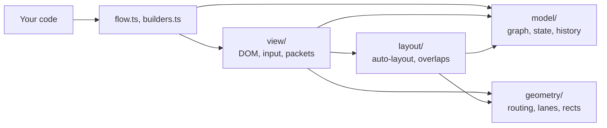
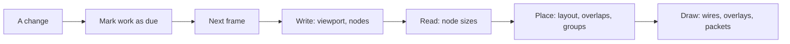

# How betternodes works

These notes explain how betternodes is put together and why. They are for anyone who wants to
change the code, or who wonders why the library behaves the way it does. The public API is in the
[README](README.md).

## The main ideas

Nodes are plain HTML elements and wires are SVG paths. There is no framework underneath and no
runtime dependency, so the library works in any page.

All DOM work waits for the next animation frame, and inside that frame every write happens before
any read. A frame only touches what changed: dragging a node re-routes the wires near it and leaves
the others alone.

Nothing a frame or an edit does walks all nodes or all wires. Only nodes and wires near the view
have elements, and far out the GPU draws them as plain shapes, so the size of the graph doesn't
decide how smoothly it pans or drags. Calls that ask for the whole graph, such as `state()`,
`load()` or a fit of everything, still cost time in proportion to it.

Routing tries cheap shapes before it searches. Straight, L and Z shapes cover most wires, and the
A* search that handles the rest has a hard cap on its work.

Node definitions live in your code. The editor state only holds what users can change, which keeps
it small enough to save as JSON. Anything that comes in from outside, whether a saved state or an
API argument, is checked before it touches the graph.

Every hot path has a benchmark with a time budget, and the benchmarks run in a real browser.

## Stack

| Part | Tool |
| --- | --- |
| Language | TypeScript 7, strict, ES2024 |
| Runtime | DOM, SVG and WebGL2, no dependencies |
| Build | Vite 8 library mode, `tsc` for type declarations |
| Tests and benchmarks | Vitest 5 browser mode, headless Chromium through Playwright |

A graph editor is often embedded in a larger app, and every dependency would add size and a chance
of version conflicts to that app. The hard parts (routing, layout, spatial hashing) are small
enough to own and tune by hand.

## Layers

The code is split into four layers, and each one only imports from the layers below it. Only
`view/` touches the DOM.



```
src/
  index.ts          public exports
  flow.ts           Flow, the public API
  builders.ts       NodeBuilder and GroupBuilder
  check.ts          input checks shared by the API
  types.ts          public types
  options.ts        options, defaults and checks
  style.css         default look
  model/            graph, saved state and diffs, undo history
  geometry/         rects, spatial hash, heap, routing, lanes, SVG paths
  layout/           auto-layout and pulling overlaps apart
  view/             frame loop, culling, nodes, wires, groups, minimap, the GPU layer
    input/          pointer and keyboard input
    packets/        packets
test/               browser tests and compile-time type checks
bench/              benchmarks with budgets
index.html          demo page
```

`model/` and `geometry/` are plain data and functions, so they run and test without a DOM. Routing
and layout know nothing about rendering, which lets either side change without the other.

## The frame loop

Reading layout, for example with `getBoundingClientRect()`, right after a DOM write forces the
browser to lay out the page on the spot. A frame that mixes reads and writes across 1000 nodes can
end up doing 1000 layouts instead of one. This is usually called layout thrashing, and the frame
loop exists to avoid it.

Calls like `node()`, `place()` or a drag don't touch the DOM. They add the node's id to one of
three sets:

- `dirty`: rebuild the node (title, content, anchors)
- `moved`: update its position and classes
- `stale`: measure its size again

Then they call `update()`, which schedules one `requestAnimationFrame` however many changes come in
before it runs. A `ResizeObserver` also marks nodes as stale when their content grows.



The frame does all of its writes first, then measures the stale nodes, then places them and draws
wires, overlays and packets. Nothing reads layout after the measuring step, so the browser lays out
once per frame.

Panning changes a single CSS transform on the world element and leaves the nodes alone. Below 50%
zoom, a `bn-far` class hides the anchors: they are too small to grab at that size. When nothing
changes, no frame runs at all.

### Culling

A page slows down with the number of elements in it, whatever the code does: panning a graph whose
50k nodes all had elements ran at 5 fps. So only nodes in the mount area get an element: the view
grown by half its size on every side. The area is made again only once the view leaves its inner
part or zooms in a lot, so most pans touch no element. Panning with 500 nodes in the page runs at
60 fps, with 5000 at 53, and the mount area keeps the count in the hundreds.

A node keeps its element while it is being dragged, holds focus or waits for auto-layout, which
needs its size. A node without an element uses its last measured size, or until then the size of
the first node measured, for routing and overlaps. When a measurement turns out different, the
usual path for a node that changed size takes over, mostly inside the margin, out of view. The
`virtual: false` option gives every node an element, for content that must stay in the page, such
as a video. Wires are culled the same way, see below.

### Far out

Below 40% zoom, titles are under 6px tall, and nodes and wires give up their elements, except a node
that holds focus or waits for layout. The WebGL2 canvas that draws packets also draws every node as
a rect with its border, and every wire as the stub-and-Z shape routing falls back to. Each is a
fixed-size record in a byte array: built once when the view first goes far, then rewritten only for
what changed and uploaded as one range. Panning changes only the shader's uniforms. Rects are two
plain triangles each: instanced drawing ran at 1 fps in software renderers, while plain triangles
drew 100k rects at 60 fps.

Colours come from the stylesheet through hidden probe elements, so status classes, the selection
accent and themes carry over. Reading them forces a style recalc, so the view looks for a theme
switch at most twice a second, in frames where nothing moved, and a far view that is otherwise
idle wakes up for that. Without WebGL2 the view keeps elements at every zoom.

## Graph and state

Your code and the editor own different parts of the graph:

| Your code | The editor state |
| --- | --- |
| Titles, content, node classes | Node positions |
| Wire notes and wire classes | Wires |
| Groups | Nodes the user deleted |

```ts
type State = {
  positions: Record<string, [x: number, y: number]>
  edges: [from: string, to: string][]
  removed?: string[]
}
```

Your code stays the single source of truth for what a node is, and the saved state stays small,
plain JSON. Each `change` event carries a `Diff` of what the edit changed, so a server can store
just that; a listener that wants the whole state calls `state()`, which costs time in proportion
to the graph. `change` only fires for user edits, never for your own calls, so saving on `change`
can't start a loop.

A wire end is written as `'node.anchor'` or just `'node'` and split at the first dot. A wire's key
in the graph's maps is `'from>to'`. That's why node ids can't contain `.` or `>`: with `>` allowed,
a wire from `a` to `b>c` and one from `a>b` to `c` would get the same key.

The graph keeps the wires at each node, the members of each group, and the keys of the wires added,
deleted, noted or classed since the view last drew. Removing nodes visits only their own wires, and
the view finds what a change touched without walking the graph. Deleting 100 selected nodes from a
100k-node graph takes about 1 ms, frame included.

## Undo

A user edit is recorded while it happens. The gesture tracks the nodes it moves, and the graph
reports each wire and node it changes on the edit's behalf; calls your code makes in the meantime
aren't recorded. Closing the record gives the `Diff` for the change event and the undo step: the
wires added and removed, the nodes deleted, and where the moved nodes were before. A stack holds up
to `history` steps (100 by default), and each arrow-key press is its own step.

Undo applies a step backwards: it brings deleted nodes back, reconnects removed wires, removes
added ones and moves nodes back. Redo applies it forwards. Both touch only what the edit changed,
and a part that no longer applies, such as a wire to a node your code removed since, is skipped.
So undo reverts the user's edit, not changes your code made after it, and a wire it brings back
goes to the end of `state().edges`. Undoing a nudge takes 0.1 ms at 100k nodes, and the step of a
one-node move holds two positions: where the node went and where it was.

## Routing wires

A wire is routed in these steps:

1. It leaves its anchor in a straight 20px stub, shorter if a neighbour is close.
2. Only nodes within the wire's reach count as obstacles: its ends grown by both stubs and a
   margin. The view's node index finds them.
3. Five cheap shapes are tested: straight, two L shapes and two Z shapes. The cheapest one that
   isn't blocked wins.
4. If all five are blocked, an A* search looks for a way around.
5. Steps 3 and 4 run first with 10px of space around each node, then again with 2px if nothing
   fits.
6. If that fails too, the wire is drawn as a simple Z shape that may pass behind a node. A wire is
   always drawn.

A route costs its length plus 40px for every bend, which favours fewer, longer segments.

The A* search runs on a sparse grid whose lines only go through node edges, the two stub ends and
the midpoint between them, so the grid stays small. A search state is a grid point plus a direction
of travel, which lets turns cost extra. The estimate of the remaining cost adds the bends any path
still needs to the distance. With no obstacles in the way that estimate is exact, so A* still finds
the cheapest route while exploring far fewer states. The search gives up after 8000 steps, which
keeps the slowest wire to roughly one frame. A grid of more than about 4 million cells isn't
searched at all, and the Z fallback is used instead.

A search can reach about 24,000 states at most, however big its grid is. All searches therefore
share one table with 65,536 slots, about 1.4 MB, instead of allocating arrays the size of the grid.
For one long wire across 1000 scattered nodes, grid-sized arrays would take 143 MB and 70 ms just
to fill. Each search gets an id, and a slot written by an older search counts as empty, so the
table is never cleared between searches. Small grids use the state number directly as the slot;
larger ones use Fibonacci hashing with linear probing.

Wires that would run on top of each other are spread into lanes side by side, up to 6px apart.
Only the middle segments move, so wires still start and end exactly on their anchors. The whole
spread stays inside the clearance band, so no lane touches a node.

### Culling wires

Every wire has a span: its two nodes' rects grown by how far routing looks around them, plus its
route's box once it has one, since a detour around a big node can leave the rest. Spans sit in a
second spatial index. A wire whose span meets the mount area gets an element, a route, lanes and a
note; the rest cost nothing until they come into view. Lanes are spread over those wires only, so
a lane offset can change as a neighbour comes or goes at the edge of the area, out of view. A packet
on a wire without an element gets a route of its own, without lanes.

Which wires a frame re-routes comes from what changed: the graph's changed wire keys, the wires at
nodes that moved, and the wires whose span meets a moved spot. When moved spots are many compared
with the wires on screen, as in a group drag, testing each of those wires beats one lookup per
spot. During a group drag, the spans of wires inside the group wait for the drop, and those wires
keep their elements.

## Skipping work that didn't change

Each frame works out what a change could have affected and skips the rest:

| When | What gets skipped |
| --- | --- |
| Nothing moved, no wire changed and the view stayed put | All wire work |
| A node or wire is far from the view | Its element, route, lanes and note |
| One node is dragged | Wires whose span doesn't meet its old or new spot |
| Several nodes are dragged together | Re-routing wires between two of them; those wires move along |
| A wire's points didn't change | Its SVG path string and its packet track |
| A wire wasn't redrawn and no node moved near its note | Placing the note again |
| A node's title or content didn't change | Its DOM, so focus in an input stays put |
| A node's classes didn't change | Writing its `className` |
| A group's members kept still | Its frame |
| Undo or redo | Everything the edit didn't change |
| No node waits for layout | Auto-layout |

Wire notes are sized from their text length, at 6.5px per character, because measuring them would
cost a layout per note.

The minimap is a canvas. Nodes are drawn once into an offscreen cache at a fixed scale, a node that
moves clears and redraws only the spots it left and took, and every frame scales the cache into
view with the group frames and the visible area on top. With the minimap on, a 50k-node graph drags
in 0.4 ms per frame.

## The spatial hash

The spatial hash answers "what is near this rectangle?" without looking at every node. The view
keeps one of node rects, updated only for nodes that moved or resized, and the wires keep one of
their spans. Routing, note placement, pulling apart overlaps, dropping dragged nodes, box selection,
culling and hits far out all use them.

It is a grid of 256px buckets, and each rectangle goes into every bucket it touches. A bucket key
packs the two cell indices into one integer, so a lookup builds no strings, and keys stay exact for
coordinates up to 2^30. A rect that moves within the same buckets, as in most frames of a drag, is
swapped in place instead of removed and added.

Some rectangles are never walked bucket by bucket. Anything wider or taller than 64 buckets, or with
coordinates beyond 2^30, goes into a separate list that is checked one entry at a time. Queries over
huge areas scan only the buckets that exist. Together, these limits keep the work bounded for any
input, `Infinity` included.

The hash keeps its own private copy of the rectangle overlap check. Sharing that function with the
router made it polymorphic in V8, and free-spot searches measured about 60% slower.

## Layout and overlap removal

Auto-layout puts each node in a column given by the longest wire path leading into it, and
columns are centred vertically. Each group gets its own horizontal band so its frame never reaches
over other nodes. Nodes added later go to the right of where nodes have been, an area that only
grows. A node is only laid out once, and positions from `at()`, `load()` or a drag always win. Only
the new nodes and the wires between them take part, so adding nodes to a large graph costs what is
added.

Rows inside a column are ordered to cut crossings between wires from one column to the next.
Sweeping left to right, each node moves to the mean row of its neighbours in the column before;
sweeping back, to the mean row of those in the column after. Rows count as fractions of their
column, so columns of different heights compare. After each of four sweeps, a Fenwick tree counts
the crossings, and an ordering is kept only if it has fewer than the best so far. So the result
never has more crossings than insertion order, which also breaks ties: a graph without crossings
keeps that order. On random graphs of 300 nodes, crossings drop from 122 to 22. Wires that skip a
column are left out of this.

The longest-path walk uses an explicit stack instead of recursion. Recursion would overflow the
call stack on a chain of a few thousand nodes wired against insertion order, and a saved state can
contain such a chain. When the walk closes a cycle, that wire counts as coming from depth -1, which
ends the cycle.

When nodes end up on top of each other, the node index finds the overlapping pairs, looking only at
nodes that changed. Of each pair, the node defined later moves. It searches the grid ring by ring
for the nearest free spot, up to 500 rings out, so even hundreds of stacked nodes find room. Nodes
stacked on one spot search on from the ring where the previous one found room: 300 of them take
8 ms instead of 85, at the price of possibly skipping a gap an inner ring still has. Nodes being
dragged are left alone until they are dropped.

## Packets

Each packet dot is a WebGL2 point sprite with 32 bytes of data. A frame uploads one buffer and makes
one draw call, however many dots there are. Far out, the same canvas also draws the nodes and wires.
Without WebGL2, dots fall back to SVG circles.

Dots are still styled with CSS. Hidden probe circles get each packet class, and their computed
`fill`, `stroke`, `stroke-width` and `r` become the dot's look. The looks are read again every
frame, so a theme switch also recolours dots that are already moving.

To move a dot along a wire, the renderer needs the point at a given distance. The browser's
`getPointAtLength()` takes about 15 µs per call, which is too slow for thousands of dots a frame.
A `Track` turns the rounded wire into a polyline that stays within 0.1px of the curve and finds
points on it with a binary search. Each packet stores its progress as a fraction from 0 to 1, so
when its wire re-routes, it stays at the same fraction of the new path. If the wire is deleted, the
packet re-plans from the node it left, and it fades out when no route is left.

A frame step is capped at 100 ms, so packets don't jump ahead when a background tab comes back. The
WebGL context is released after 2 seconds with neither dots nor a far view, since browsers allow
only about 16 contexts per page. With `prefers-reduced-motion` set, dropped dots disappear without a
fade.

## Pointer input

Gestures listen on `window`, so moves and the drop register wherever the pointer goes.
`setPointerCapture` isn't used because it would retarget `pointerup` to the drag source. Holding a
drag within 40px of the border pans the view, at a speed based on elapsed time rather than frame
rate. A press that moves less than 4px counts as a click. Far out, where nodes have no elements,
the node under the pointer comes from the node index instead.

## Input checks

Everything from outside is checked where it enters, before anything changes, and no input can make
the work or memory grow without limit.

| Input | Check | Without the check |
| --- | --- | --- |
| `load(state)` | Shape, numbers within ±1,000,000,000, wires as string pairs | `1e309` in JSON becomes `Infinity`, and loops over it never end |
| `at()`, `viewport()`, `zoomBy()` | Finite numbers, zoom above 0 | The same endless loops, or a broken view |
| CSS class names | Not empty, no whitespace | `classList.add()` throws inside a frame, and rendering stays broken |
| `send()` speed | Finite and above 0 | A speed of 0 never arrives, so the animation runs forever |
| Node ids | No `.` or `>`, not `__proto__` | Two different wires can share one key; a `__proto__` key in `state().positions` sets the prototype, and the position is lost |
| Options | Zoom above 0, min not above max, whole-number history | Broken zoom or undo |

`load()` checks the whole state before it touches the graph, so it never leaves a half-loaded graph
behind. A state that isn't shaped like `{ positions, edges }` is rejected as a whole. Bad entries
inside a valid state are dropped with one warning per list rather than one per entry, so a huge
crafted list can't flood the console.

Titles and notes are set with `textContent`, never `innerHTML`. The event target is private, so
other code can't fire fake `change` events. After `destroy()`, no more frames run and `send()`
resolves with `[]`. Every error message starts with `betternodes:`.

The type system checks wire ends too. `End<S>` is a template literal type, so a literal such as
`'a.x'` fails to compile, because `x` isn't an anchor. Strings that are only known at runtime are
checked at runtime.

## Tests and benchmarks

Tests run in headless Chromium through Vitest's browser mode, not in a simulated DOM, so layout,
`ResizeObserver` and WebGL behave the way they do for users. `test/types.check.ts` is compiled but
never run. Its `@ts-expect-error` lines prove that wrong calls fail to compile.

`npm run bench` measures medians in the same headless Chromium, which draws WebGL in software, and
a scenario fails when it goes over its budget. Frame budgets are 8 ms, about half of a 60 fps frame
(16.7 ms), which leaves the rest for the browser and the host app. The 1000-node graphs below fit
into view far out, so their frames draw on the GPU.

| Scenario | Median | Budget |
| --- | --- | --- |
| Mount 1000 nodes and 970 wires | 15 ms | 500 ms |
| Mount 5000 nodes and 4843 wires | 43 ms | 3000 ms |
| Frame while dragging a node, 1000 nodes | < 0.1 ms | 8 ms |
| Same, 5000 nodes, a class on every wire | < 0.1 ms | 16 ms |
| Same, 5000 nodes, 1000 notes on bent wires | 0.3 ms | 16 ms |
| Same, 1000 nodes, 20 groups, minimap on | 0.1 ms | 8 ms |
| Frame while dragging 100 nodes, 1000 nodes | 0.6 ms | 8 ms |
| Same, minimap on | 2.2 ms | 8 ms |
| Same, 5000 nodes | 0.5 ms | 32 ms |
| Frame while dragging all 1000 nodes | 4 ms | 8 ms |
| Frame after undoing a move, 1000 nodes | 0.1 ms | 10 ms |
| Frame with 1000 packets on bent wires | 0.2 ms | 8 ms |
| Route 1000 short wires | 10.4 ms | 50 ms |
| Route 300 long wires among 200 nodes (worst case) | 92 ms | 600 ms |
| Route 10 long wires across 1000 scattered nodes | 85 ms | 300 ms |
| Remove 1000 nodes at once | 0.2 ms | 2 ms |
| Auto-layout 1000 nodes | 1 ms | 5 ms |
| Pull apart 300 nodes stacked on one spot | 7.7 ms | 400 ms |
| Frame rate while dragging or panning, 1000 nodes | 60 fps | 30 fps |
| Frame rate with 2000 packets in flight | 60 fps | 30 fps |

`bench/scale.bench.ts` runs the same scenarios on square grids of 1k, 10k and 100k nodes, and fails
when a frame or an edit at 100k costs more than 1.5 times what it costs at 1k, plus 0.5 ms.

| Scenario | 1k | 10k | 100k |
| --- | --- | --- | --- |
| Mount, whole graph fitted | 18 ms | 101 ms | 785 ms |
| Frame while dragging a node, zoom 1 | 0.3 ms | 0.1 ms | 0.1 ms |
| Frame while dragging 100 nodes, zoom 1 | 0.9 ms | 0.8 ms | 0.8 ms |
| Arrow-key edit | 0.2 ms | 0.1 ms | 0.1 ms |
| Undo of that edit | 0.1 ms | 0.1 ms | 0.1 ms |
| Delete 100 selected nodes | 1 ms | 0.9 ms | 1 ms |
| Pan at zoom 1 | 60 fps | 60 fps | 60 fps |
| Pan with the whole graph fitted | 60 fps | 60 fps | 21 fps |

## Development

```sh
git clone https://github.com/virtualtear/betternodes.git
cd betternodes
npm install                       # also builds dist/
npx playwright install chromium   # once, for tests and benchmarks
```

| Script | What it does |
| --- | --- |
| `npm run dev` | Demo page at http://localhost:5173 |
| `npm test` | Type checks, then browser tests |
| `npm run test:watch` | Tests in watch mode |
| `npm run bench` | Benchmarks with budgets |
| `npm run build` | `dist/index.js`, `dist/index.d.ts`, `dist/style.css` |

The demo has edit mode, undo, packets and an event log. Add `?n=1000` (or any count) to the URL for
a stress test with an fps counter.

If you change anything on a hot path, run `npm run bench` before and after. No row should get more
than 5% slower, and if a number looks like noise, run it again.

The code follows a few rules:

- Strict TypeScript, with `import type` for type-only imports.
- The layers stay intact: no DOM outside `view/`, and no imports from a higher layer.
- No runtime dependencies.
- DOM writes go through the frame loop, and layout is never read between writes.
- Changes don't add allocations to code that runs every frame.
- Public API input is checked where it enters.
- Exported declarations get a one-line TSDoc summary, and comments explain why rather than what.

## Known limits

| Limit | When it shows | Next step |
| --- | --- | --- |
| Software WebGL draws the wires of a fully fitted 100k-node graph slowly: 500k line segments a frame | 21 fps panning in headless Chromium; hardware WebGL wasn't measured | One straight line per wire when its stubs are under a pixel on screen |
| Auto-layout measures each new node, so it mounts every node it lays out once | Auto-laying out tens of thousands of new nodes at once | Positions from `at()` or `load()`, or a size hint per node |
| A wire's span uses its route once it has one; an unrouted wire that would detour around a very large node far out of view can be culled while the detour crosses the view | Nodes larger than the half-view margin | Grow spans by the largest node size |
| Crossing reduction ignores wires that skip a column | Graphs with many long wires | A dummy node per skipped column |
| Theme switches reach what canvases draw within half a second | Far zoom and the minimap | A `MutationObserver` on the root's classes, so `bn-dark` switches show at once |
